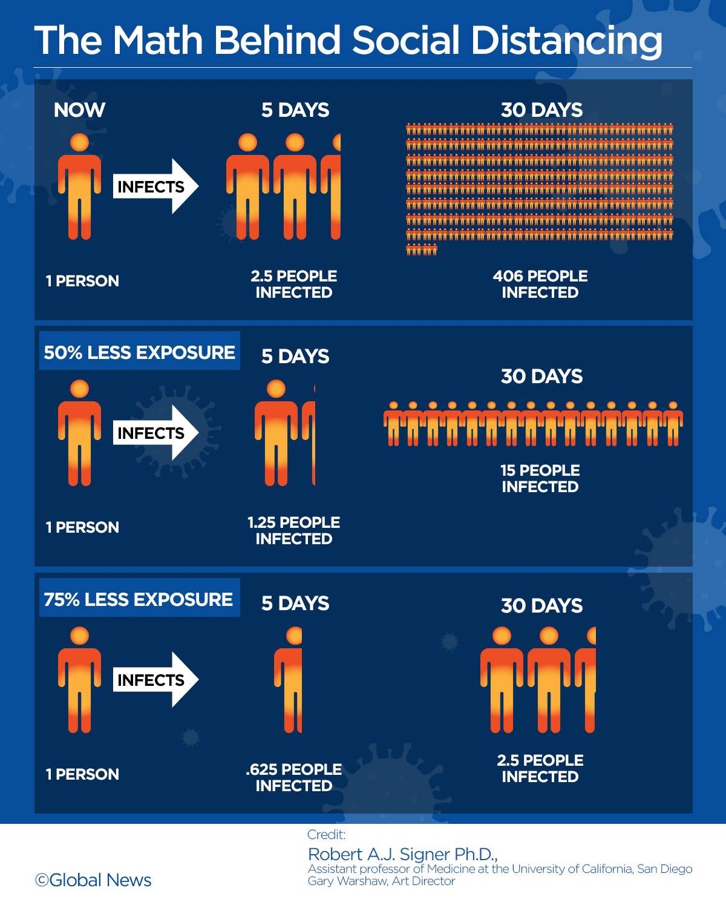

Dear LKYSPP Alumni and Friends -

I hope you have all kept well, in the midst of this COVID-19 outbreak.

1. This year the pandemic that is affecting all our lives comes hand in hand with 24/7 news coverage worldwide. Besides the coronavirus, we have had to deal with our immediate need for information, and we have had to navigate an ever more urgently-needed but more complicated, fractured news landscape.
2. One of the things we get from education is to become better at critically judging what we read: we gain that spider-sense to detect if what we're looking at is credible, and to know when it's not. This understanding &mdash; the way we handle information pushed at us &mdash; is not always easy to explain to others. For all the criticism we hear of how "the world has had enough of experts" and derision heaped on "mere book learning", it is precisely expertise and learning that we have always asked to rise to the challenge of solving the world's greatest problems.
3. It always takes an interrupted moment for me to remember that it has only been a little over two months that Singapore had its first confirmed COVID-19 case. At that time, remember, the world overall paid little attention because nothing had yet happened to most of it.
4. But in a short ten weeks, the world changed. The word Social is no longer automatically followed by Media; instead, Distancing. Singapore has [deployed its financial reserves][2020.03-ST-Past-Reserves-Only-Second-Time] for only the second time in history as an instrument of government spending. Every society has been forcefully reminded why leadership and scientific expertise are important, and why these latter have to be surfaced through rigorous assessment; excellence in these domains is not negotiable. 
5. Closer to home, large changes have set in across all Singapore and at our School's campus. I thought I would use this letter to help explain some of what we're doing at LKYSPP. There is a lot to say, but in this message I thought I would focus on just two matters. First, international students; and second business continuity planning (BCP, or, in everyday non-corporate language, how our work practice has changed in response to the coronavirus outbreak).

## International Students

1. Everyone who has been to the School fondly remembers its vibrant cosmopolitan atmosphere. This international experience is matched by few other institutions anywhere in the world.
2. In their own COVID-19 battles several nations  &mdash; Norway, the US, India, Malaysia, Thailand, Australia, Bhutan, Israel, France, Turkey, Saudi Arabia, the Philippines, among others &mdash; have asked their citizens to return home. Singapore has asked the same of Singaporeans. Individual families and concerned parents have put out the same call on their loved ones coming home to be with them. All this has been happening at a time of rising restrictions on international travel, with strong prospect for more. We appreciate the stress this has placed on everyone. At LKYSPP we have facilitated returns of our students as best we can, while making sure that those who wish to remain in Singapore are taken care of and know they are welcomed. For those who decided to return to their home nation, LKYSPP continues their scholarship support even after they leave Singapore. We have put in place digital and online capacity so our students' learning continue; we organised examination procedures that make sure no student is disadvantaged on their assessment, regardless where they might be. All this has been done, acknowledging the exigent circumstances in which we have found ourselves.  But there will be no compromise on standards in this arrangement. 
3. For fairness and solidarity with those who have gone home in this way, LKYSPP has additionally called for all our modules to go entirely digital and online. As you know better than anybody else, LKYSPP is unlike other communities at NUS in first that we are an exclusively graduate school, and second in that 80% of our students are from outside Singapore. It is one thing to have two or three students absent from a lecture of 25&mdash;such a class meeting can certainly continue relatively normally. It is something else, however, to have 80% of the lecture attendants not physically present. We decided, therefore, that it was better to have everyone online. We realise that compared to our usual mode of operation this might potentially detract from the student experience. We have worked very hard to preserve the best experience possible, and will continue to improve practice. This all-online structure will apply for the rest of this Semester [so just two more weeks], and will be reviewed subsequently.
4. In line with this, major changes have been announced on our PAE and GSP procedures. We are pursuing alternatives to the traditional end of year Valedictory Dinners, for which everyone has fond memories.
5. A final personal observation on what we've done here to keep our community safe: The risk situation is sharply asymmetric. Technically, it's not just the average that matters for everything in an epidemic outbreak; important also is the tail outlier. We can feel 95% protected, having gone digital and online to that degree, say. That high a protection ratio then reduces mean exposure correspondingly. We might therefore feel protected and safe to a 95% degree. However, the remaining 5% could well be what drives 80% of the social infection. (The [South Korea situation][2020.03-Reuters-Korean-Cluster] illustrated this tragically. In initial stages intensive testing kept matters under control, but then the one young woman (Patient 31) who didn't get tested when she'd been advised to do so, attended service twice at the Shincheonji Church of Jesus, and exposed the coronavirus to 9300 others. Within a short space of time this specific event pushed confirmed cases in South Korea into the hundreds.)  There is a judgment call in everything. Releasing our students in the way we have done recognises they are grownups with specific proclivities on coronavirus transmission; no social disruption ensues from their not being in school; and they are well-placed to take care of themselves.

## BCP: Split Teams and Telecommuting

1. The most significant BCP measures we have put in place at the School relate to the combination of Split-Team working and Telecommuting (or Work From Home WFH). On 17 Feb 2020 we split all admin and research staff into two teams, each coming in on alternate weeks, with the other working from home. A few weeks after that, on 02 Apr 2020, we strengthened this arrangement by encouraging even the in-name on-site that-week team also to work from home. 

2. While an unsuspecting onlooker might think our School had gone all quiet, that would be incorrect. In reality, pretty much all work continues.  Our admin and research staff are as busy as you remember them to be. But we have lightened our footprint at the Bukit Timah Campus, reduced the burden on Singapore's transport system, and further lowered the risk of local COVID-19 infection.

3. A common complaint across many university campuses elsewhere is, "I can never find my Professor in his office to ask him about this course!" Around the world, academic faculty have always been allowed to work from home, They were telecommuting  before telecommuting was a thing. Our LKYSPP academic faculty are of course conscientious to a fault in engaging with students and colleagues. We have reminded them, given the circumstances, they are allowed, indeed encouraged, to work from home. 

   

## Conclusion

Going forwards, we will be monitoring and reviewing the situation as yet more information comes in. When we need to, we will modify arrangements. Reflecting on our strategies, we always keep in mind official rules and advisories. Nothing we do ever transgresses those. 

I think, however, it's also useful  to have a view of the world that is pragmatically flexible: Official directives provide a guide in setting a threshold that one should never cross. However, in specific circumstances, one can afford to be marginally more cautious. It is in that spirit that we have put in place the arrangements we have done.

Social distancing figures prominently in the measures we have adopted. By now everyone has seen the justly-famous graphic by Robert Signer, on how due care and social distancing can lead to the difference between infecting 400 people or infecting basically none. 

(For those among our alumni who want to understand this more, it turns out to be a straightforward calculation involving geometric series. Unusually for a letter&mdash;but then this is for our LKYSPP alumni after all&mdash;the technical appendix below shows this.)

Singapore is not under lockdown the way a lot of the rest of the world has gone. Previously,  [Minister Lawrence Wong, 24 Mar 2020][2020.03.24-Lawrence.Wong-ST] had described the situation this way: "All over the world, millions of people are living in a different reality. Workplaces are closed, shops are empty, roads are empty, everyone is asked to stay home. We are not experiencing this in Singapore - not yet, but we cannot be complacent."  Indeed, in keeping with the constant vigilance, from 03 April, Singapore put in place significantly stricter measures, akin to a circuit-breaker, as  a decisive move to pre-empt further escalation in infections: Essential services continue &mdash; so food establishments, markets and supermarkets, utilities, transport, and key banking services remain open. Keeping safe distancing, people can go out alone or with household members to pick up food and groceries, or to exercise in a neighborhood park.

Closer to home for the academics, you might have already heard that Harvard University's President Lawrence Bacow and his wife Adele tested positive for COVID-19 recently ([Harvard Crimson, 25 Mar 2020][2020.03.25-Harvard-President-COVID-19-Crimson]). So the Harvard leadership is needing to adjust, some going online. Even before this, all Harvard's students had already been asked to not return to campus, and Harvard's classes moved online. Similar reorganisations are being made on university campuses all across the world. 

Any time that such social arrangements are put in place, the individual in the group sees multiple competing concerns. Often a tradeoff emerges on what the individual feels they ought to be able to do and what is being told them is the social imperative. To take just one example, even today as Singapore sees rising COVID-19 incidence driven by imported cases, about 1000 Singaporean residents continue daily to travel abroad ([ST 24 Mar 2020][2020.03.24-Singaporean-residents-travel-abroad-still-ST]). This might be because they see an individual benefit to their doing so, but do not take into account the costs, social or specific.  Or they might appreciate the latter, but for them the individual benefit remains larger.  The Singapore government has decided that should these people contract COVID-19 and need to receive treatment, they will pay the full costs of hospital treatment and medical care, and be unable to claim from MediShield Life or Integrated Shield Plan for their treatment. This helps align better the real costs for the individual, against what they will continue to see as individual benefit. But the solution remains imperfect, for the social cost of epidemic&mdash;the negative externality that is the spillover from infecting others&mdash;has not been factored in and brought explicitly to the attention of that individual's pocketbook. Every nation's healthcare system and personnel are under considerable stress. As do many of you, I have personal friends in the medical care profession bravely continuing to go in to work under extreme conditions, because the COVID-19 outbreak continues to rage across the world. The externality is not yet internalised.

Any country in the world that does not get matters under control will see that lockdown become more and more probable. At LKYSPP and NUS we have already taken a great deal of thoughtful care in how we're navigating this time. I have suggested that in isolated pockets like LKYSPP we might be able to do a bit more, while keeping very much to what official advisories say. All of us have cooperated on that, and have been understanding of what we have needed to do.

If complete lockdown happens, all our lives will be severely impacted. We can take a bit more care now, inconvenient though it might be, and keep things otherwise as normal and open as possible. Or we can choose to be careless, and face the rising possibility of a complete lockdown. Together we can work to prevent that, and instead keep as much as possible our normal way of life.

## Technical Appendix

(This Appendix is for those who are sorely missing the Quantitative Analysis module from your days on the Bukit Timah Campus.)

The Robert Signer graphic derives from  a calculation using divergent geometric series.  Suppose $m$ is the number of people that someone &mdash; himself infected but unknowingly so &mdash; goes on to infect in five days, after which that individual is quarantined. Then after ten days (two cycles), those $m$ people have gone on to infect $m\times m$ or $m^2$ others. On the third cycle, new infections number $m^3$, and so on. Therefore, in a month (six cycles) the total number of infections in society is $X=\sum_{j=0}^6 m^j$.  

More generally, over $T$ cycles, society suffers total number of infections given by
$$
X = \sum_{j=0}^T m^j = m^T \times \sum_{j=0}^T m^{-j} = (m^{T+1}-1) / (m-1).
$$
For the novel coronavirus's basic reproduction rate of $m=2.5$, the total number of infections $X$, according to this formula, comes to 406 (the first line of the Signer graphic).  If, however, with due care and social distancing, society reduces $m$ by 75%, or $m=0.625=2.5\times0.25$ then, again by the formula, the 30-day total infection $X$ falls to 2.57, or rounding to halves, the last line of the Signer graphic. The same calculation shows that lowering $m$ by 50% reduces $X$ to 15.

To conclude, in terms of multiplier impact, 50% lessened exposure through Social Distancing implies a 96% reduction in total infections over a month. This is a pretty good payoff ratio. Going further to 75% lessened exposure implies a 99.4% reduction in infections, or close to 100% eradication. 

\-\- Danny Quah (Letter to LKYSPP alumni, Apr 2020)

[2020.03-ST-Past-Reserves-Only-Second-Time]:https://www.straitstimes.com/politics/president-halimah-yacob-gives-in-principle-support-to-draw-on-past-reserves-for-second	"President Halimah gives in-principle support to draw on past reserves"
[2020.03-CNA-Telecommuting]:https://www.channelnewsasia.com/news/singapore/covid19-firms-do-not-allow-telecommuting-stop-work-order-12594322	"COVID-19: Firms that do not allow telecommuting may be issued stop-work order"
[2020.03-Reuters-Korean-Cluster]: https://graphics.reuters.com/CHINA-HEALTH-SOUTHKOREA-CLUSTERS/0100B5G33SB/index.html "The Korean Cluster"
[2020.03.24-MOH-Tighter-Measures]: https://www.moh.gov.sg/news-highlights/details/tighter-measures-to-minimise-further-spread-of-covid-19 "Tighter Measures to Minimise Further Spread of COVID-19"
[2020.03.24-Lawrence.Wong-ST]: https://www.straitstimes.com/singapore/health/all-entertainment-venues-in-singapore-to-close-gatherings-outside-work-and-school	"Min Lawrence Wong, Gatherings restrictions, ST 24 Mar 2020"
[2020.03.25-Harvard-President-COVID-19-Crimson]: https://www.thecrimson.com/article/2020/3/25/harvard-coronavirus-bacow-tests-positive/ "Harvard President Bacow tested positive for COVID-19"
[2020.03.24-Singaporean-residents-travel-abroad-still-ST]: https://www.straitstimes.com/singapore/singapore-residents-who-continue-to-travel-will-pay-full-hospital-charges-if-warded-for "Full hospital charges for Singapore residents continuing to travel abroad"

