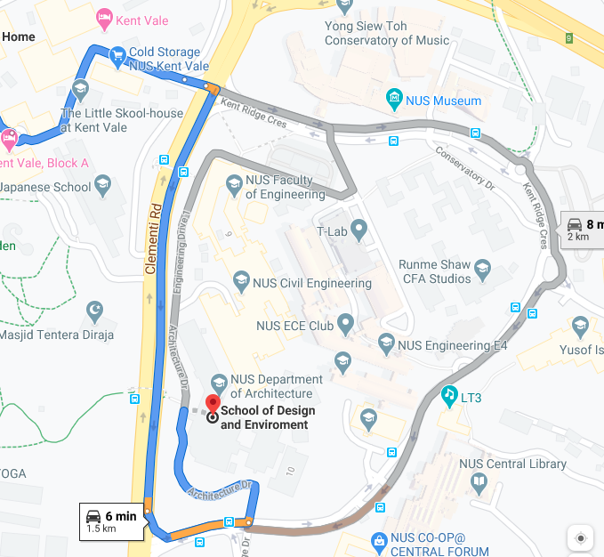

# 2020.01.24-nCov-2019-NUS

WhatsApp groups: (DQ) LKYSPP-Incident-Commander – formed 2020.01.24 

(TEC) NUS Senior Group – formed 2020.01.20; added 2020.01.25 

(DQ) LKYSS-BCP-NUS-reporting - formed 2020.03.28.1200h

MOE tel\# +65.9840.1720 for NUS staff/students at Changi in trouble with ICA (via Bernard Tan WA 2020.03.29.1522h)

 

<https://myaces.nus.edu.sg/OverseasTravelDecl/declaration/declareForSelf> Use this for Overseas Travel Declaration

https://www.moe.gov.sg/faqs-wuhan-coronavirus-infection Ministry of Education FAQ 

http://nus.edu.sg/osa/resources/dos-update - NUS Dean of Students updates 

https://emergency.nus.edu.sg/circulars Repository for NUS circulars and FAQ 

https://myaces.nus.edu.sg/nusvrs/ Visitor Registration

[OLD https://aces.nus.edu.sg/OverseasTravelDecl/ Overseas Travel Declaration; not working particularly well ]

DQ research references

https://blog.gdeltproject.org/a-quarter-of-worldwide-economic-news-coverage-mentions-coronavirus-now/

DORSCON (Disease Outbreak Response System Condition) 

https://www.moh.gov.sg/diseases-updates/being-prepared-for-a-pandemic

Yellow - "Be socially responsible: If sick, stay home. // Maintain good personal hygiene. // Look out for health advisories." 2020.02.02

Orange - "/// Comply with Control Measures"

Red &mdash; "/// Practice social distancing: Avoid crowded areas"

PPE &mdash; Personal Protective Equipment: Cap, N95 mask, gown, and gloves.

CIT &mdash; Centre for Instructional Technology

DQ travel Jan-Mar (plus adjacent)

| From-Date           | To-Date             | Hubei  | Mainland China | Where                   | Outbound               | Inbound                   |
| ------------------- | ------------------- | ------ | -------------- | ----------------------- | ---------------------- | ------------------------- |
| Thu 05 Dec 2019     | Sat 07 Dec 2019     | No     | No             | Tokyo                   |                        | SQ635 2019.12.08 0525     |
| Fri 13 Dec 2019     | Sun 15 Dec 2019     | No     | No             | Doha                    |                        | QR942 2019.12.16.0915     |
| Wed 08 Jan 2020     | Sat 11 Jan 2020     | No     | No             | Paris                   | SQ336 2020.01.08 0015  | SQ335 2020.01.12.0615     |
| Thu 23 Jan 2020     | Mon 27 Jan 2020     | No     | No             | Kuala Lumpur            | SQ5304 2020.01.23.0920 | SQ5319 2020.01.27.0830    |
| ~~Sat 08 Feb 2020~~ | ~~Sun 09 Feb 2020~~ | ~~No~~ | ~~No~~         | ~~Kuala Lumpur~~        |                        |                           |
| ~~Wed 27 Feb 2020~~ | ~~Mon 02 Mar 2020~~ | ~~No~~ | ~~No~~         | ~~London~~              |                        | ~~SQ317 2020.03.03.0750~~ |
| Tue 24 Mar 2020     | Sun 29 Mar 2020     | No     | No             | Hawaii / SF transit (1) | SQ032 2020.03.24.0920  | SQ001 2020.03.31.1150     |
| ~~Sun 12 Apr 2020~~ | ~~Wed 15 Apr 2020~~ | ~~No~~ | ~~No~~         | ~~Washington DC~~       |                        |                           |

Details on the 2020.03.24 trip:

Tue 24 Mar 2020 0920h SQ032 // SIN.T3 to SFO arr 0850h 

Tue 24 Mar 2020 1420h UA300 // SFO.T3 to HNL arr 1652h 

 

Sun 29 Mar 2020 1300h UA724 // HNL.T2 to SFO.T3 arr 2101h 

Mon 30 Mar 2020 0115h SQ001 // SFO.Intl to SIN arr 1150h+1 

(2020.01.23 2100h) OSHE Dr Peck Thian Guan Director

- nCoV - novel Coronavirus - pneumonia
- Defer travel plans to China, with immediate effect
- If returned from China, monitor health closely for two weeks; seek medical attention promptly if unwell
- Avoid contact with live animals
- Practice good personal hygiene as always but also do frequent handwashing with soap
- Wear a mask if respiratory symptoms like cough or runny nose
- Seek medical attention if unwell: University Health Centre at NUS or, outside office hours, the nearest 24-hour clinic or Accident and Emergency Department at nearest hospital [which ones closest to CG?]
- osaresponds@nus.edu.sg (students); ohrsharedservices@nus.edu.sg (staff)

We want to be cautious; our top priorities remain the safety and health of LKYSPP students and staff. Please contact us if any questions.

(2020.01.24 1724h) Advisory on Novel CoronaVirus  

SPPFacultyandResearch@nus.edu.sg

| from:    | **Danny Quah** <D.Quah@nus.edu.sg>                           |
| -------- | ------------------------------------------------------------ |
| to:      | "Danny Quah (d.quah@nus.edu.sg)" <d.quah@nus.edu.sg>         |
| bcc:     | Abdikyerim Jansulu <sppaj@nus.edu.sg>,.. SPPFacultyandResearch@nus.edu.sg |
| date:    | 24 Jan 2020, 17:24                                           |
| subject: | LKYSPP Faculty, Researcher, and Staff Advisory on Novel Coronavirus Pneumonia #dqWR-39887373 |

Dear Colleagues,

1              In view of the confirmed cases of novel coronavirus infection in Singapore yesterday and today, the School has set up an internal task force led by me and comprised of representatives from key departments. This task force will work closely with NUS’s Office of Safety, Health, and Environment to put in place measures and processes to manage any suspected/confirmed cases of the virus infection.

2          Given the international community at the LKY School and potential travel plans in this festive period, we urge all colleagues to continue to exercise caution and pay careful attention to personal hygiene. All colleagues should monitor their health closely for two weeks upon return to Singapore and seek medical attention promptly if they feel unwell. For your safety, please defer your travel plans to China with immediate effect, until further notice. An NUS travel declaration system will be opened next week for you to indicate your recent travel.

 

3          For updates on the virus situation in Singapore, please visit <https://www.moh.gov.sg/2019-ncov-wuhan> . If you have any further queries, please contact our colleagues from the Office of Human Resources at [**ohrsharedservices@nus.edu.sg**](mailto:ohrsharedservices@nus.edu.sg).

 

4         We urge all colleagues to remain calm and vigilant and, again, to be sensible and to continue good personal hygiene practices. Avoid contact with live animals; refrain from consuming raw and under-cooked meals. Do frequent handwashing with soap.

 

5          Ours is an international community that has gathered together for study and fellowship. By working together and understanding each other's concerns, we will get through this. The health and safety of all students and colleagues remain our highest priority.

 

6         On behalf of the School, I wish all a healthy and prosperous lunar new year.

 (2020.01.27 1100h) Advisory #2 Novel Coronavirus Pneumonia // LKYSPP Faculty, Researcher, and Staff #dqWR-39887373

Bcc: Long list explicit, SPPFacultyAndResearch (VDAA to students)

| from:    | **Danny Quah** <D.Quah@nus.edu.sg>                           |
| -------- | ------------------------------------------------------------ |
| to:      | "Danny Quah (d.quah@nus.edu.sg)" <d.quah@nus.edu.sg>         |
| bcc:     | Abdikyerim Jansulu <sppaj@nus.edu.sg> ... SPP Faculty and Research <SPPFacultyandResearch@nus.edu.sg> |
| date:    | 27 Jan 2020, 16:42                                           |
| subject: | Advisory #2 Novel Coronavirus Pneumonia // LKYSPP Faculty, Researcher, and Staff #dqWR-39887373 |

Dear Colleagues,

 

1. As you know, there has been a rapidly-unfolding sequence of events surrounding the novel coronavirus outbreak.  Four cases have now been confirmed in Singapore.

1. Earlier today, NUS sent out a 2nd advisory circular (<https://emergency.nus.edu.sg/circulars>) to all NUS students and staff, containing vital information and strict instructions.  We have again enclosed the circular in this email as the information in it is urgent and site traffic volume might be high.

1. The school is in contact with our students and staff who have returned from Mainland China between 13 Jan and 27 Jan 2020 as well as those currently in Mainland China, and who will be returning on or after 27 January 2020. We will continue to keep in touch with these fellow members of our community as events and news unfold, but as you will see from the attached circular, the University has put in place strict protocols on China travel.

1. Again, we urge all colleagues to remain calm and vigilant and continue to practise good personal hygiene. Avoid contact with live animals; refrain from consuming raw and under-cooked meals. Do frequent handwashing with soap.

1. Please continue to check your NUS email and NUS Emergency Information site (<https://emergency.nus.edu.sg/circulars>) regularly for update and instructions.  For updates on the virus situation in Singapore, please visit<https://www.moh.gov.sg/2019-ncov-wuhan>.

 

Please be assured that the School and the University are continuing to put in place the necessary measures to ensure the wellbeing of our LKYSPP community. Your wellbeing remains our top priority.

 

(Had suggested)

As you will all have heard, there has been a rapidly-unfolding sequence of events surrounding the novel coronavirus outbreak.  Four cases have been confirmed in Singapore. The Ministry of Education has mandated that all students and staff who have been in mainland China in the last 14 days take a compulsory 14-day leave of absence from when they arrive back in Singapore. 

The arrangements we have made are:

1. Those resident in College Green affected will...
2. Staff affected will...

Those with questions should contact...

Everyone should avoid inessential travel to mainland China.

https://emergency.nus.edu.sg/circulars

(2020.01.29 0950h) Update 2020.01.29 Novel Coronavirus Pneumonia // LKYSPP Community #dqWR-39887373

SPPAllStudents, SPPInternalStaff, SPPTeachingFacultySeminar2 

| from:    | **Danny Quah** <D.Quah@nus.edu.sg>                           |
| -------- | ------------------------------------------------------------ |
| to:      | d.quah@nus.edu.sg                                            |
| bcc:     | SPP All Students <SPPAllStudents@nus.edu.sg>, "Staff, SPP" <SPPStaffInternal@nus.edu.sg>, LKYSPP Teaching Faculty Sem2 <SPPTeachingFacultySem2@nus.edu.sg> |
| date:    | 29 Jan 2020, 09:52                                           |
| subject: | Update 2020.01.29 Novel Coronavirus Pneumonia // LKYSPP Community #dqWR-39887373 |

Dear LKYSPP Community:

Many of you will already be following the fast-evolving Wuhan Coronavirus situation on official sites at Factually and Singapore Ministry of Health, CNA and Straits Times microsites, or even  Prime Minister's Telegram, Minister of Education's Facebook, and NUS's Instagram streams. Please continue to do so.  

Given how we work at LKYSPP, you're all already used to the highest standards of academic rigour, so exercise the appropriate skepticism on non-trusted sources otherwise. 

This email is to update on measures being taken at NUS and LKYSPP. The situation continues to evolve, so continue to monitor your news feeds and email.

Take very seriously the Leave of Absence requirements in Circular 2 previously circulated. Fill out and send back the Travel Declaration form sent yesterday from Coronavirus_LKYSPP Staff. Our sense of social responsibility should already tell us these measures are designed to safeguard the safety of our community.  But beyond that, failure to comply will be subject to disciplinary procedures deemed appropriate for the situation. 

NUS Dean of Students Leong Ching will provide daily updates on NUS measures regarding the Wuhan Coronavirus pneumonia  situation at 

<http://nus.edu.sg/osa/resources/dos-update>

Some key items from the last update (late evening Tue 28 Jan 2020): No student living on campus has contracted the virus; no one is suspected of being infected. Government Quarantine Facilities have been activated at Prince George's Park Residences. Those quarantined are healthy and asymptomatic. If anyone quarantined does begin to show symptoms, special ambulances transfer them immediately to designated hospitals. Quarantine orders are legal restrictions. Those quarantined cannot leave their rooms; only trained staff otherwise have access to these facilities. 

Anyone feeling unwell should stay away from events. 

Classes — one way or another, online or offline — continue. Almost surely, e-learning mechanisms will have to kick in significantly in the coming weeks. 

The highest priority in all this remains the safety and health of our LKYSPP community of students and staff.

Scientific evidence and public health analysis of risk factors are driving the ongoing Ministry and University-level discussion and measures. There is, as always, a balance between prudent necessity and what might be perceived to be blanket over-reaction. As Dean of Students Ching says in her update, "This will be a long haul", but the measures we are taking now will help prepare us for that journey.   

(2020.01.29 1815h) Drive LKYSPP to KVE1

(2020.01.30 0830h) WhatsApp Senior Group // Thank you for cleaning up the OverseasTravelDecl flow. This will be very helpful for the University's and individual faculty monitoring. I'm sure this has all been hard work done under extreme pressure. I hope you don't mind some suggestions meant to be constructive and helpful.

1. The form begins "Please declare your recent travel. // Declare a record for each ... that you have travelled to [...]". This is all past tense. This doesn't suggest to the user that you intend them to fill in travel between Jan and Mar, i.e., **upcoming** travel in the near future. (Some people tell me they got here, and decided this form is not relevant to them, or try to submit a NIL return.)
2. The "Date & Time of Arrival in Singapore" and "Inbound Flight/Vehicle Details": This remains ambiguous. If I'm already back in Singapore from an early January trip, I might think that's the information relevant here. Then if I've filled in the main form with March travel as well (say), the system says invalid input. If I have multiple trips upcoming, do I fill in here the very last arrival (in the future)? Or the one that matters for my currently being back in Singapore? Does it matter what my last arrival time in Singapore will be in March since that's not yet happened and might still change?
3. Once I've done a "Submit All Records" and I realise I'd forgotten to input another trip, the system does not make clear whether I can input just this additional trip or whether I have to start all over again.
4. On point 2., with experimentation I've found that that "Date and Time of Arrival" field thinks it should receive the information from the very last trip, i.e., from my final trip in March. Then the form can be submitted with validity. (This is why I wrote the details I did in item 2., but had carelessly left out this critical bit.) Again, @Tommy Hor - thanks to you and your team for all this hard work under such intense time pressure.

(2020.01.30 0848h) Update 2020.01.30 Novel Coronavirus Pneumonia // Locations when applying for leave // LKYSPP Staff #dqWR-39887373

SPPInternalStaff, SPPTeachingFacultySeminar2 

| from:    | **Danny Quah** <D.Quah@nus.edu.sg>                           |
| -------- | ------------------------------------------------------------ |
| to:      | d.quah@nus.edu.sg                                            |
| bcc:     | "Staff, SPP" <SPPStaffInternal@nus.edu.sg>, LKYSPP Teaching Faculty Sem2 <SPPTeachingFacultySem2@nus.edu.sg> |
| date:    | 30 Jan 2020, 08:48                                           |
| subject: | Update 2020.01.30 Novel Coronavirus Pneumonia // Locations when applying for leave // LKYSPP Staff #dqWR-39887373 |

Dear Colleagues: Given the continuing Novel Coronavirus situation, I ask everyone to indicate explicitly your travel plans — where you will be, where you are transiting — when you apply for admin/academic (as you already do) but also, importantly, **vacation** leave. While we always put down explicit travel plans for admin/academic leave, we sometimes neglect to indicate those when  applying for vacation leave.  Starting today, VD.AA or your Reporting Officer will come back to you to ask for travel plans before approving any vacation leave if you have not provided that information.  Please also ensure that NUS has a proper set of records so make sure to check TRAC/staff portal. Delete or cancel leave promptly with any change of plans.   

(The University's Circular #3 from last night points you to a form to declare upcoming overseas travel as well. As of this morning, a number of problems remain with that reporting process, but NUS teams are working on fixing that right now. With luck that system should be fixed soon. Either way, however, please follow the reporting flow described in my earlier paragraph.) 

2020.01.30.0900h-Scenarios-Workshop-1-OTH.Conf

(2020.01.30 1010h) Rohan Mukherjee's [FB post](https://www.facebook.com/photo.php?fbid=10162851447120366&set=a.10150325170760366) on India Coronavirus advisory -> IR-G4

<https://pib.gov.in/PressReleasePage.aspx?PRID=1600895>

(2020.01.30 1156h) Update 2020.01.30 Novel Coronavirus Pneumonia // LKYSPP Community #dqWR-39887373

SPPAllStudents, SPPStaffInternal, SPPTeachingFacultySeminar2 

| from:    | **Danny Quah** <D.Quah@nus.edu.sg>                           |
| -------- | ------------------------------------------------------------ |
| to:      | D.Quah@nus.edu.sg                                            |
| bcc:     | SPP All Students <SPPAllStudents@nus.edu.sg>, "Staff, SPP" <SPPStaffInternal@nus.edu.sg>, LKYSPP Teaching Faculty Sem2 <SPPTeachingFacultySem2@nus.edu.sg> |
| date:    | 30 Jan 2020, 11:56                                           |
| subject: | Update 2020.01.30 Novel Coronavirus Pneumonia // LKYSPP Community #dqWR-39887373 |

Dear LKYSPP Community:

Last night NUS issued Circular 3 in its continuing Advisory on Novel Coronavirus (2019-nCoV) - this has been disseminated already in a number of different ways so I won't overburden you Inbox with it again.  

The Circular asks you to postpone all travel to mainland China, and to submit your personal and official travel plans on the indicated online form. (There might be still some remaining issues with that form, that I and others have identified and communicated onwards late last night, but NUS teams are working on fixing that soon, so please check back when you can.) 

At our School we have put in place our own travel tracking and analysis: complying with it only takes a couple minutes, so please help Cindy and VDAA with this when you're asked.

Some more general observations:

Everyone who has recently been in Hubei province is under quarantine if they're now back in Singapore, or, otherwise, disallowed entry into or transit through Singapore.

To facilitate contact tracing, all NUS department and office access is now possible only with NUS staff or student ID: this is in force 24 hours a day. 

For those on mandatory Leave of Absence, the 14-day LOA period is strict. Violation of LOA and Self-Quarantine, or making false travel declaration, will be subject to an immediate 1-month suspension, with NUS Board of Discipline having discretion to increase the duration of suspension. Repeat offenders face possible expulsion from NUS. 

(The statement in DOS-update on this is directed at students, but I have confirmed that it applies to everyone in the NUS community.)

Some of this might strike us as perhaps a bit severe. However, as NUS Dean of Students Leong Ching explained late yesterday evening in her daily update

<http://nus.edu.sg/osa/resources/dos-update>

"the gloves are off". This is because public interest demands. The health and safety of students and staff remain paramount.

Even now, nonetheless, better angels among us have been volunteering in food delivery and otherwise helping those in our community who have had to be isolated or quarantined. The rest of us celebrate and cheer on those volunteers, and try to help one another in whatever way we best can. 

(2020.01.30 1703h) Many of us in Singapore are already following the fast-evolving nCoV situation on official sites at Factually and Singapore Ministry of Health, CNA and Straits Times microsites, or even Prime Minister's Telegram, Minister of Education's Facebook, and NUS's Instagram streams. It's just good sense to exercise skepticism on non-trusted sources otherwise.
Friends elsewhere in the world, however, might not have sight of the measures that have been taken here.
The National University of Singapore (of which Lee Kuan Yew School of Public Policy is part) has asked all its community to postpone travel to mainland China, and to keep Reporting Officers informed of travel plans generally.
Everyone who has recently been in Hubei province is now under quarantine if they're back in Singapore, or, otherwise, disallowed entry into or transit through Singapore.
To facilitate contact tracing, all NUS department and office access is now possible only with NUS staff or student ID: this is in force 24 hours a day.
For those on mandatory Leave of Absence, the 14-day LOA period is strict. Violation of LOA and Self-Quarantine, or making false travel declaration, will be subject to an immediate 1-month suspension, with NUS Board of Discipline having discretion to increase the duration of suspension. Repeat offenders face possible expulsion from NUS.
Some of this might strike us as perhaps a bit severe. However, as NUS Dean of Students Ching Leong explained late yesterday evening in her daily update

http://nus.edu.sg/osa/resources/dos-update

"the gloves are off". This is because public interest demands. The health and safety of students and staff remain paramount.

Even now, better angels among us have been volunteering in food delivery and otherwise helping those in our community who have had to be isolated or quarantined. The rest of us celebrate and cheer on those volunteers, and try to help one another in whatever way we best can.

[Facebook](https://www.facebook.com/DannyQuah/posts/10101433645999091) | [LinkedIn-1](https://www.linkedin.com/posts/dannyquah_singapore-ncov-activity-6628591042885234689-KiOy) [LinkedIn-2](https://www.linkedin.com/posts/dannyquah_singapore-ncov2019-activity-6628591489167564800-qY8J)

| from:    | **Danny Quah** <D.Quah@nus.edu.sg>                           |
| -------- | ------------------------------------------------------------ |
| to:      | Danny Quah <D.Quah@nus.edu.sg>                               |
| bcc:     | SPP All Students <SPPAllStudents@nus.edu.sg>, "Staff, SPP" <SPPStaffInternal@nus.edu.sg>, LKYSPP Teaching Faculty Sem2 <SPPTeachingFacultySem2@nus.edu.sg>, Danny Quah <sppdqlsh@nus.edu.sg> |
| date:    | 2 Feb 2020, 19:27                                            |
| subject: | Update 2020.02.02 Novel Coronavirus 2019-nCoV // LKYSPP Community #dqWR-39887373 |

Dear LKYSPP Community:

I've been quiet for a couple days in these communications, as I want to take care not to overburden all of you with too much email. A quick summary of some recent developments, however, might be useful this evening.

- Three NUS students were today served quarantine orders. They are asymptomatic but have been placed in the Government Quarantine Facility at Prince George's Park Residences.
- I emphasised previously that LOA is to be taken seriously. However, if you're on LOA, own it: Not everyone was there, but at the last LKYSPP Faculty Meeting Ben Chen and I had an animated discussion about e-gaming. I don't know about Ben, but last year — even before 2019-nCoV — I had had to miss Counter-Strike Global Offensive ESL One championships in New York City. 
- Strong Singapore WiFi, however, means you're never long out of touch, even if you're on LOA. NUS's e-Gaming Society plans to mount a 10-day social e-gaming event, from Wed 05 Feb 2020. Unfortunately, it won't include CS:GO but I understand League of Legends, Dota 2, and Overwatch are on tap. So, if you don't yet have a cool Gamertag, ...
- With [misinformation spreading online](https://www.bbc.com/news/blogs-trending-51271037), a good reliable go-to constant is to be valued more than ever. Turn to our own NUS Dean of Students daily update <http://nus.edu.sg/osa/resources/dos-update>
- NUS DOS's updates are colourful but also rigorous and informative. They give us a sense of developments, concerns, and work being done elsewhere on our NUS campus on this 2019-nCov challenge.  The #QOTD Questions of the Day section lets you see what others at NUS are thinking about, and what NUS's response is on those concerns. This evening's reported email exchange regarding student worries on campus is both poignant and important.
- In recent updates there have also been uplifting accounts of how others around NUS are handling the challenges we all now face. An RA at one of NUS's colleages, when offered a choice on whether he would deliver dinner to those on LOA, insisted on doing so and simply said, "This is what leadership means. These are our friends. We take care of them."
- Webcasting for lectures is, by Provost mandate, now required practice around NUS. To be clear, no one disputes the benefits of deep learning from face to face engagement, but circumstances are exigent, and health and safety of our students, staff, and faculty must figure importantly in this time.
- Singapore is now at DORSCON Yellow  ("Disease Outbreak Response System Condition"), taking into account both severity and spread in potential impact. DORSCON Yellow carries the implication that everyone should be socially responsible (if you're sick or on LOA, stay home); keep up personal hygiene; and pay attention to health advisories. If government assesses that DORSCON level goes up to Orange [the next level] or the highest level, Red, then 100% of our learning activity will have go to online.
- Unnecessary steps are, well, ... unnecessary: Chest X-rays, blood tests, face masks (unless you display respiratory symptoms).
- Take seriously, however, viral illness symptoms: sore throat, cough, fever, breathing problems. If you show these, head on over to the University Health Centre or a medical clinic.

Get out into the sunshine, stay fit, keep your immune system strong.

Again, keep well and take care of one another. 

[Facebook](https://www.facebook.com/DannyQuah/posts/10101436302405631) | [LinkedIn](https://www.linkedin.com/posts/dannyquah_2019ncov-activity-6629738149436325888-VMx5)

(2020.02.05 0630h) Coronavirus: Assemblies and other large group activities in Singapore schools and pre-schools to be suspended, Straits Times (04 Feb 2020) https://www.straitstimes.com/singapore/coronavirus-assemblies-and-other-large-group-activities-in-schools-and-pre-schools-to-be

"Assemblies, camps, mass celebrations and other large group and communal activities will be suspended at schools here from Wednesday (Feb 5) after the first local transmissions of the coronavirus were reported on Tuesday (Feb 4).

The Ministry of Education (MOE) and Ministry of Social and Family Development (MSF) said in a joint statement that the suspension affects primary and secondary schools, special education schools, junior colleges and Millennia Institute.

Recess times in schools will also be staggered, although co-curricular activities and after-school programmes may continue but in smaller groups."

Coronavirus: S'pore reports first cases of local transmission; 4 out of 6 new cases did not travel to China, Straits Times (04 Feb 2020) https://www.straitstimes.com/singapore/coronavirus-spore-reports-first-cases-of-local-transmission-4-out-of-6-new-cases-did-not

"Singapore has recorded its first cases of local coronavirus transmission, with four women here infected who had not travelled to Wuhan, the epicentre of the outbreak.

Two work at Yong Thai Hang, a Chinese health products shop in Cavan Road, in Lavender, that caters to Chinese tour groups.

The third is a maid of one of the women, while the fourth is a tour guide who had taken groups to the same shop."

| from:    | **Danny Quah** <D.Quah@nus.edu.sg>                           |
| -------- | ------------------------------------------------------------ |
| to:      | Danny Quah <D.Quah@nus.edu.sg>                               |
| bcc:     | SPP All Students <SPPAllStudents@nus.edu.sg>, "Staff, SPP" <SPPStaffInternal@nus.edu.sg>, LKYSPP Teaching Faculty Sem2 <SPPTeachingFacultySem2@nus.edu.sg>, Danny Quah <sppdqlsh@nus.edu.sg> |
| date:    | 6 Feb 2020, 12:12                                            |
| subject: | Update 2020.02.06 Novel Coronavirus 2019-nCoV // LKYSPP Community #dqWR-39887373 |

Dear LKYSPP Community:

Writers often like to report that John Maynard Keynes retorted to unfriendly questioning, "When the facts change, I change my mind. What do you do?" There is actually no evidence that Keynes ever said this. All indications are that another equally influential economist, with skill for the soundbite, said that Keynes said that. (Today, of course, we might call out that second economist for his fake news.) 

Given how Keynes thought about the world, he might more likely have said "Even when the facts don't change, I can sometimes change my mind".   

(Writing out a 2x2 matrix is helpful here.)

The 2019-nCoV situation is rapidly evolving, both worldwide and on the ground here in Singapore. When the best evidence we've got at any instant can change in the 24 hours that follow, even policy that seems prudent one day can seem either excessively lax or ridiculously harsh the day after.

Local transmission has now been reported in Singapore (Tue 04 Feb 2020). Local transmission means that those testing for 2019-nCoV have not travelled recently to Wuhan, but instead are determined to have been infected here.  Four such cases have been documented; the cluster is localised in geography around a health product shop in Cavan Road. One of those cases (Case 21) is an Indonesian domestic helper for yet another of the cases (Case 19), but - to repeat - she herself had no recent travel history to China. Case 19 has also not travelled to China recently, but the health product shop where she works was visited by a tour group from China on Thu 23 Jan.  A third of these local transmission cases (Case 24) served as tour guide for that group. That tour group itself has since returned to China; infection was detected 13 days after its arrival in Singapore.

Together with this account, Ministry of Health said there is no evidence as yet of widespread sustained community transmission. In prudence, on Wed 05 Feb 2020, the Ministry of Education suspended large gatherings in schools — assemblies, camps, mass celebrations. This suspension specified educational institutions to which it applied, but universities were not included.

So, at the School (and at NUS more generally), we have had to come up with our own codes of behaviour. Depending on circumstances, different groups around NUS have to do what works best for themselves, subject to the overall general advice provided by Ministries. Optimisation theory tells us that this "variable geometry" or, in RCEP language, "Special and Differential Treatment" is needed when underlying conditions in different decision units can vary quite dramatically.

At LKYSPP we have already put in place 100% travel declarations for all visitors [and obviously for all students, staff, and faculty already]. 

However, LKYSPP puts on a lot of public events — an important part of what the School does is public outreach and dissemination. We hold to the rigorous standards of the best academic institutions but we are not ivory tower. We engage fully with the community.

At the same time, as a colleague of mine put it, we are not Changi Airport. We don't have bandwidth, for one, to carry out full-blown thermal scanning on everyone that comes through our buildings or to our public events. (Although again, to be clear, we require travel declaration for everyone via a standard online form.)  In these difficult times, we have had to balance public openness with appropriate prudence and acknowledgement of capacity constraints. Some dedicated colleagues are already working up to 20 hours a day, online, in behind-the-scenes deliberation, negotiation, 1-1 communications, and decision-forming.

Therefore, with rare exceptions, for the time being, LKYSPP public events are insisting on advance full-registration and 100% participant travel declaration. Some of our events are moving towards by-invite operation; others will have to restrict numbers. If at all possible, check ahead of time by email or our social media platforms to confirm participation. 

As the public health situation and understanding unfold, we (as with everyone else) might have to continue to adjust our behaviour. And, like the made-up Keynes I introduced earlier, I reckon it's OK to change policies, even if the facts don't change, but our understanding sharpens from rigorous analysis and model simulations (mathematical epidemiology, among others).

Having said all this, our School continues to have a lively set of seminars and workshops in the coming weeks, and we continue to welcome participants as we advance our intellectual, academic, and public mission.

PS As always, frequently drop in on our NUS Dean of Students updates for the latest advisor but also for the many uplifting stories of how our University's people have so generously come together to help so many.  Not just that, but especially for those who cut their teeth early on, on Reddit's (sometimes not very savoury) Ask Me Anything, see how modern digital infrastructure can be deployed in positive ways when Provosts, Deans, Health and Safety Directors, and others in NUS Senior Management engage with the community in our very own AMA sessions.

<https://www.channelnewsasia.com/news/singapore/wuhan-coronavirus-singapore-virus-new-cases-local-transmission-12390118>

<https://www.straitstimes.com/singapore/large-scale-gatherings-in-schools-suspended-from-today>

<http://nus.edu.sg/osa/resources/dos-update/>

| from:    | **Danny Quah** <D.Quah@nus.edu.sg>                           |
| -------- | ------------------------------------------------------------ |
| to:      | Danny Quah <D.Quah@nus.edu.sg>                               |
| bcc:     | SPP All Students <SPPAllStudents@nus.edu.sg>, "Staff, SPP" <SPPStaffInternal@nus.edu.sg>, Danny Quah <sppdqlsh@nus.edu.sg>, LKYSPP Teaching Faculty Sem2 <SPPTeachingFacultySem2@nus.edu.sg> |
| date:    | 8 Feb 2020, 21:23                                            |
| subject: | Update 2020.02.08 Novel Coronavirus 2019-nCoV // LKYSPP Community #dqWR-39887373 |

Dear LKYSPP Community:

As you know, regarding 2019-nCoV, Singapore went DORSCON Orange the evening of Fri 07 Feb 2020.  

When I was a PhD student, one of the mantras I worked to — that I had to get into all the mathematical models I analysed — was "When policy rules change, so should behaviour."  Now, when I do fundraising and am speaking to those who don't see how  academic research benefits them, the question I am asked is, "Yeah, but what does that do for me?" These two guides to conduct aren't really all that different. Today, it translates to, "What does DORSCON Orange mean to me? How should my behaviour change?"

DORSCON means Disease Outbreak Response Condition, with Orange indicating estimated moderate to high public health impact. DORSCON Orange adds to Yellow that the public needs to comply with control measures. Inessential large-scale events should be canceled or postponed. The terms "inessential" and "large-scale" require some interpretation and precision, into some of which I will go below. However, the implications include, until further notice, the following:

1. All lecture meetings that involve more than 50 participants — counting lecturers, teaching assistants, anyone sitting in — go entirely interactive-online or are recorded for online access as of Mon 10 Feb, until further notice.
2. The requirement in 1. applies, by logic, to all lectures in LKYSPP core modules, except for MIA core.
3. Entry to the School will now only be allowed Mon-Fri 0730h-1730h. (The few modules meeting outside these hours are having special arrangements put together for them.) If you're already inside the School outside of those hours, you can of course still leave but re-entry is not permitted.
4. Entry into the Lee Kuan Yew School is now only via the front door of Oei Tiong Ham lobby. All exits will remain as normal, but we ask the LKYSPP community to help maintain the no-entry policy everywhere except OTH lobby front door. Those arriving on the campus shuttle bus will no longer be able to come in through the entrance by Li Ka Shing building. Obviously, the one OTH building lobby entrance can potentially be a bottleneck, depending on volume of traffic, so if you're coming in on a regular basis you will want to arrange the timing on your arrivals judiciously.
5. Entry is automatic for those LKYSPP students, staff, and faculty who have filed online their temperature declaration (and it shows lower than 38 degrees Celsius) and are wearing a lanyard that displays their NUS ID. If you haven't already filed online or you aren't able to show your NUS ID, you will be temperature-scanned.  For those who need thermometer and lanyard, please pick up the package containing these after you come into LKYSPP; further details will be provided in a message from Ops in due course — please look for it in the next day.
6. Entry for everyone else is only permitted after temperature scanning. Those with recorded temperatures 38deg Celsius or higher will not be allowed in. (So, remember that little walk up the hill to OTH lobby in the bright sunshine? Stroll it gently.)
7. Monday 10 Feb and the first few days after that, congestion will likely be higher, but then over time as more LKYSPP people file temperature declarations and wear lanyards, fewer and fewer people coming in will need to be temperature-scanned. Of course temperature-scanning will continue for non-LKSYPP visitors. 
8. For external visitors, only those with official business will be allowed into the premises.
9. Public events with attendance fewer than 50 (including speaker, moderator, and staff present) will go on as usual. Those larger will be either interactive-online or recorded for online access. Facebook Live will be the preferred channel for interactive-online; details will be provided for each such event.

Finally, as you know, not least from Dean of Students' daily updates several of our fellow students are on Leave of Absence. Anyone from our LKYSPP community who wants to volunteer for food delivery to our LOA friends, could you please contact Dean of Students (our very own) Leong Ching [ching@nus.edu.sg](mailto:ching@nus.edu.sg) . Helping out on this is a wonderful and uplifting way to continue to show how we are really one community, and that we're all pulling for each other through this difficult time.

<https://www.straitstimes.com/singapore/health/coronavirus-new-measures-to-kick-in-as-singapore-moves-to-code-orange> 

2020.02.08 OSHE Advisory 6

<http://nus.edu.sg/osa/resources/dos-update>

(2020.02.12 1603h) Also emailed // Update 2020.02.12 COVID-19 // LKYSPP Community // Be Safe. Wash your hands #dqWR-39887373

| from:    | **Danny Quah** <D.Quah@nus.edu.sg>                           |
| -------- | ------------------------------------------------------------ |
| to:      | Danny Quah <D.Quah@nus.edu.sg>                               |
| bcc:     | SPP All Students <SPPAllStudents@nus.edu.sg>, "Staff, SPP" <SPPStaffInternal@nus.edu.sg>, LKYSPP Teaching Faculty Sem2 <SPPTeachingFacultySem2@nus.edu.sg>, Danny Quah <sppdqlsh@nus.edu.sg> |
| date:    | 12 Feb 2020, 16:03                                           |
| subject: | Update 2020.02.12 COVID-19 // LKYSPP Community // Be Safe. Wash your hands #dqWR-39887373 |

Dear LKYSPP Community -

(I'm emailing this to you but, as usual, if there are minor changes or improvements, those go on the version of this message that's on my Facebook page.)

Now and then I hear speculation that people are being told not to wear masks because (whispering) "there won't be enough to go around". Since masks don't last forever, demand for them over time is unbounded: no finite supply will ever "be enough to go around". Instead, common sense and good personal hygiene will go a long way to protect yourself as well as those around you.

Over the years, the evidence that has accumulated, from literature meta-surveys and from practice in the field, suggests that good hygiene &mdash; wash your hands vigorously; apply sanitizers &mdash; are highly effective against the spread of respiratory viruses. Certainly, surgical masks have a role to play but unless you're in a situation of focused contact, their efficacy can only be imperfect and will deteriorate, from social engineering factors as much as inappropriate usage. 

Breathing through masks is uncomfortable, and without proper care, masks don't seal perfectly and you are likely to remove them improperly. Used over a period of time, masks get contaminated, so unless you keep replacing them, you could be getting a concentrated hit of piled-up bacteria that, otherwise, might dissipate harmlessly. What your mouth and nose emit eventually cover the inside of your mask: that attracts bacteria... and, when you think about it for a second, is actually pretty disgusting.

Of course, if someone around you is coughing and sneezing, do ask them to wear a mask. Someone wearing a mask is to protect you from them, not them from you. So, if you are coughing and sneezing, please do put on a mask: You tell the world you care about their well-being, but except in specific circumstances, it's not to protect yourself.

NUS Dean of Students Ching Leong updated yesterday evening on our colleague Prof KK Phoon's description of the ALARP Principle, i.e., "As Low As Reasonably Practicable". In every situation of risk, weigh up costs and benefits: act when the ratio between them is out of the realm of ordinary experience. Balancing out costs and benefits, drawing on rational thinking and a firm evidence base, has got to be always the right approach.

Jefferson, T. et al. 2011. Physical interventions to interrupt or reduce the spread of respiratory viruses. Cochrane Library (July) doi:10.1002/14651858.CD006207.pub4

Rosenthal, Elisabeth. 2020. How to Avoid the Coronavirus? Wash Your Hands. New York Times (28 Jan) <https://www.nytimes.com/2020/01/28/opinion/coronavirus-prevention-tips.html>

<http://nus.edu.sg/osa/resources/dos-update>

Garrett, Laurie. 2020. The Wuhan Virus: How to Stay Safe. Foreign Policy (25 Jan) <https://edition.cnn.com/2020/01/24/opinions/wuhan-coronavirus-china-strategy-garrett/index.html>

<https://www.channelnewsasia.com/news/world/wuhan-virus-coronavirus-who-new-name-12424116>

[Facebook](https://www.facebook.com/photo.php?fbid=10101441685697471&set=a.581923808231&type=3&theater)

| from:    | **Danny Quah** <D.Quah@nus.edu.sg>                           |
| -------- | ------------------------------------------------------------ |
| to:      | Danny Quah <D.Quah@nus.edu.sg>                               |
| bcc:     | SPP All Students <SPPAllStudents@nus.edu.sg>, "Staff, SPP" <SPPStaffInternal@nus.edu.sg>, LKYSPP Teaching Faculty Sem2 <SPPTeachingFacultySem2@nus.edu.sg>, George Yeo <georgeyeo54@gmail.com> |
| date:    | 14 Feb 2020, 09:19                                           |
| subject: | Update 2020.02.14 COVID-19 //LKYSPP Community //COVID-19 NUS case; no students had recent contact. Added safety measures // Headline points #dqWR-39887373 |

Dear LKYSPP Community - 

(I'm emailing this to you but, as usual, if there are minor changes, those go on the [version of this message that's on my Facebook page](https://www.facebook.com/DannyQuah/posts/10101442588842561).)

(2020.02.14 0849h) Update 2020.02.14 COVID-19 //LKYSPP Community //COVID-19 NUS case; no students had recent contact. Added safety measures // Headline points #dqWR-39887373

Dear LKYSPP Community - 

(I'm emailing this to you but, as usual, if there are minor changes, those go on the version of this message that's on my Facebook page.)

Yesterday evening, Ministry of Health's updates contained the information that Case 53, testing positive for COVID-19, works at NUS.  Case 53 began to show symptoms only the night of Mon 10 Feb; he let NUS know as soon as he was told he was suspected to be infected with COVID-19.  

Case 53 had had no contact with students since the previous week Wed 05 Feb.  Everyone who has interacted with him recently is on mandatory 14-day Leave of Absence. All are well, with no symptoms. The instant NUS heard of the confirmed infection, everything where Case 53 had been on Mon 10 Feb was thoroughly cleaned and disinfected.

Case 53 is a Singaporean professor who has no travel history to China. He has been isolated since Wed 12 Feb at the National Centre for Infectious Diseases (NCID). He is connected to the cluster &mdash; of seven cases at this writing &mdash; at Grace Assembly of God, that operates in premises at Tanglin and Bukit Batok.

Case 53 works at NUS's School of Design and Environment (SDE). Let me draw a couple maps (accompanying):

SDE is at the south-eastern end of NUS Kent Ridge Campus, that in turn is 10km from Bukit Timah Campus. SDE is a 1.5km walk down Clementi Road from where the inter-campus bus turns into the Kent Ridge campus, across from Kent Vale.

What are the implications for our LKYSPP community?  

I emphasise again the importance of our control measures on our campus; our move of all large class meetings to e-learning from early this week; our live-streaming public events, as appropriate.  (So, bonus, if you couldn't make it to an event in which you're interested, you might just catch it later, on Facebook Live typically.) Our working together as a community; our keeping ourselves safe and healthy, in turn helping others around us keep that way; our conscientiousness, vigilance, and responsibility on providing information on travel and temperature: these all feed positively off one another, and go a long way to continuing to make sure all members of our entire School remain safe and healthy.   As President described in his message last night, "the personal responsibility provided by the SDE professor and the information he provided" allowed NUS to take swift action in contact tracing and cleaning and disinfection. All this helped contain risk to our wider community.

Again, critical in all this: good personal hygiene and social responsibility. 

Further measures we are taking as of today will be communicated imminently, so please keep an eye on your email Inboxes. Be assured, no learning or service provision to students will be disrupted.  However, among other things, we are piloting a scheme to reduce risk, with staff and faculty using a split-team work arrangement. Our policy remains that classes with size below 50 continue, but we will be move those with relatively higher enrolment into larger classrooms. For individual academic consultation, students and teachers are encouraged to use online tools. Visitor entry to campus will be tightened further. 

<https://www.moh.gov.sg/news-highlights/details/eight-more-confirmed-cases-of-covid-19-infection>

<http://nus.edu.sg/osa/resources/dos-update>

| from:    | **Coronavirus_LKYSPP Staff** <sppbx178@nus.edu.sg>           |
| -------- | ------------------------------------------------------------ |
| to:      | Cindy Tan Pei Cheng <cindy.tan@nus.edu.sg>                   |
| date:    | 14 Feb 2020, 10:12                                           |
| subject: | [For Info & Action] COVID-19 - Operational Update & BCP (14022020) |

Dear Colleagues,

We would like to provide an operational update on our latest precautionary measures in response to the COVID-19 situation.

 

**FACULTY & STAFF** 

**1.       Business Continuity Plan – Split-Team Work Arrangement**

With the occurrence of a few local cases of COVID-19 without any links to previous cases or travel history to China, the School has stepped up our Business Continuity Plan (BCP) to ensure continuity of services and as a precaution in the event of community infection. 

From 17 February 2020, Monday, the School will trial the split-team work arrangement.  All Admin and Research Staff will be divided into two teams according to exigencies of duty. The alternate teams (Team A and Team B) will be physically segregated to avoid the risk of cross-infection between teams; and deployed according to different work schedules or at different work sites.  You will be informed by your Head of Department (HOD) on your department’s work arrangement.

In order for the business continuity measure to work, please observe and abide by the following pointers:

**a.         Avoid close contact between Teams.**

•      All communications between Team A and Team B must be by electronic means only.

**b.         Do not randomly change Teams.**

•      You are assigned to Team A or B by purposeful design; your functional team lead planned it to ensure each team will be able to carry on with the accounts of the other team should anything happen. 

•      By operating out of the assigned structure, you could jeopardize this by becoming the carrier of any risk elements present to the other team.

**c.         Business As Usual**

•      We will step up to learn to conduct our business as usual in this new mode of operations and we will continue to be fully effective. 

•      Please ensure you can always be contacted by electronic means.

**d.         Meeting and Social Protocols**

•      If face-to-face meetings are needed, only 3 persons are allowed to sit together, and for not more than 30 minutes.  Meetings are preferred to be conducted by teleconferencing with some or all of the meeting attendees.   

•      You may attend necessary external meetings as long as your colleagues in the alternate team are not attending the same meetings.

•      Avoid handshakes and practice other forms of gesture/greetings.

 

We need to be mindful that split-team work arrangements are critical to maintaining social distance while ensuring that work continues effectively.  All staff must, therefore, take the work arrangements seriously to ensure business continuity and to keep the NUS and LKYSPP community safe.

 

**2.       Preparing to telecommute**

To enable a smooth transition, you should prepare and review the following with your HOD:-

a.    Check your email connections from home

b.    Access to shared folders where documents and critical information are accessible (without forwarding them to your personal email address)

c.     Download and test web conferencing tool ZOOM on your laptop: <https://wiki.nus.edu.sg/display/cit/Zoom#Zoom-Download>.  Zoom app is also available on your handphone platforms.

d.    Bring your laptop home everyday.

e.    If you are currently a desktop computer user, please continue to use your personal laptop when you are working from home.  Else, please inform your HOD to put up a laptop request with IT.

 

**3.         Twice-daily Temperature Reporting**

All faculty and staff are reminded to take their temperature twice daily including days that you are on leave, weekends and public holidays, and to declare them on an online system: <https://myaces.nus.edu.sg/htd/>.  We would like to appeal to all faculty and staff to please self-help and take your own temperature.  If you do not have a personal thermometer / yet to collect your personal thermometer, please approach the admin office at OTH Level 2M. 

 

**4.         Sick Leave**

If you are unwell, please visit a doctor to obtain a medical certificate (MC) and inform your reporting officer.  All application of sick leave without MC will be suspended until further notice.

 

**EXTERNAL VISITORS**

 

**5.         Entry & Visitor Temperature Screening Station**

Please note that operation hours for OTH lobby temperature screening station will be revised to Monday to Friday, 8.30am to 2.30pm, with effect from next Monday, 17 February.  You are strongly encouraged to hold meetings with external visitors within the revised operations hours.   

 

 

In spite of the split-team work arrangement, restricted visitor hours and other precautionary measures, let us all continue to do our best each day to ensure the school will remain operational for our students, partners and clients.  Thank you for your continued cooperation and support.

 

For further enquiries, please email to [Coronavirus_LKYSPP](mailto:sppbx178@nus.edu.sg).   For latest NUS updates on COVID-19, please click [here](https://emergency.nus.edu.sg/).

 

Best Regards,

Cindy

(2020.02.18 0930h) LOA at NUS

CC - Confirmed Case

PUQ - Person Under Quarantine; QO - Quarantine Order; Infectious Diseases Act.  Usually, one degree of separation from CC

LOA - Leave of Absence

Voluntary Social Distancing

(2020.02.18 1350h) In my academic research, when I manipulate data, I am borderline obsessive about making sure I know where every single number fits in the picture I draw for the reader.  So, when asked, in the midst of  COVID-19 outbreak in Singapore, to record my temperature twice-daily, I do so scrupulously, and plan to store the accompanying digital images not just for seven days [for random audit purposes] but ... errrrr, for maybe quite a bit longer.

I figure if I'm not careful with the data in my life, how can you trust me on the data in my papers?

\#ThisIsMe #COVID19

(Don't get me started on my personal finance spreadsheets, and the records on my daily runs storing satellite geo-coded location, km-by-km split times, analytics across previous runs, cadence, VO2 max estimates, PBs, ...)

[Facebook](https://www.facebook.com/DannyQuah/posts/10101444811248841) | [Twitter](https://twitter.com/DannyQuah/status/1230084292379725824) | [LinkedIn](https://www.linkedin.com/posts/dannyquah_thisisme-covid19-activity-6635855066274369537-cTNy)

So, in my other lives: 

- I'm not a particularly good runner, but I keep meticulous spreadsheets on every single run I do (recording average pace and split km by km, heart rate, analytics comparing the current run with all previous ones; comparisons cross-sliced by satellite geo-coded location, elevation, slope, cadence; whether I do accompanying core work, or am too busy);
- I have a spreadsheet for my personal finances (who doesn't... but down )

| from:    | **Simon Chesterman** <chesterman@nus.edu.sg> |
| -------- | -------------------------------------------- |
| to:      | LAW Staff <LAWStaff@nus.edu.sg>              |
| date:    | 18 Feb 2020, 19:33                           |
| subject: | COVID-19 – NUS Law update #6                 |

Dear Colleagues,

 

As we approach the mid-point of the semester, I hope that you are adjusting to the new normal of temperature-screening and partial e-learning. The situation is likely to continue for some time as the virus runs its seasonal course, so we must do our best to ensure that our educational and research activities are minimally interrupted.

 

I’m pleased to share that all the students previously on Leave of Absence (LOA) have now completed their periods of withdrawal and are now able to rejoin our community. We continue to have students in Shanghai participating in the IBL LL.M. remotely, but have no indication that any of them are unwell.

 

We do, however, have a first-year student who was issued a quarantine order (QO) earlier today as a family member tested positive for COVID-19. This appears to be linked to one of the churches that has had a cluster of cases. Demonstrating a high level of responsibility, the student had in fact self-quarantined from last Wednesday. There is no indication that the student is sick.

 

The student’s teachers have been notified.

 

In accordance with NUS protocols, staff and students who have closely interacted with those who are on LOA or QOs (these are healthy individuals) before they went on LOA/QO are NOT to be issued LOAs. Nevertheless, these staff/students are encouraged to practise social distancing for at least three days. Since that period has now passed, and in the absence of any indication of illness, there is no special action that those teachers or their students need to take at this time.

 

So please carry on monitoring your temperature, practising good hygiene, and if you are unwell seek medical assistance. (Please do try to take your own temperature rather than relying on the screening station. If you need a thermometer, Jenny has some for staff.)

 

I look forward to seeing many of you at tomorrow’s job talk by our graduate Benoit, and for a well-earned drink on Friday from 5pm.

 

Best wishes,

 

Simon

| from:    | **Danny Quah** <D.Quah@nus.edu.sg>                           |
| -------- | ------------------------------------------------------------ |
| to:      | Danny Quah <D.Quah@nus.edu.sg>                               |
| bcc:     | SPP All Students <SPPAllStudents@nus.edu.sg>, "Staff, SPP" <SPPStaffInternal@nus.edu.sg>, LKYSPP Teaching Faculty Sem2 <SPPTeachingFacultySem2@nus.edu.sg>, Danny Quah <sppdqlsh@nus.edu.sg>, George Yeo <georgeyeo54@gmail.com> |
| date:    | 18 Feb 2020, 19:45                                           |
| subject: | Update 2020.02.18 COVID-19 // LKYSPP Community // FOL, e-learning, split-team working #dqWR-39887373 |

(2020.02.18 1938h) Update 2020.02.18 COVID-19 // LKYSPP Community // FOL information #dqWR-39887373

Dear LKYSPP Community - 

(I'm emailing this to you but, as usual, if there are minor changes, those go on the version of this message that's on my Facebook page.)

This week at the Bukit Timah Campus a first-year Faculty of Law student was issued a Quarantine Order as his father had tested positive for COVID-19. The father has links to a church cluster previously identified in other cases. 

To be very clear, the student displays no symptoms whatsoever. He had indeed already self-quarantined since last Wed 12 Feb, and showed great social responsibility in voluntarily coming forward to the Faculty of Law.

NUS protocols state that staff and students are NOT issued LOAs if they had interacted with those currently on LOA or QO [healthy individuals], before the latter went LOA or QO.  In an abundance of caution, however, NUS also encourages those of us who have so interacted to practice social distancing for at least three days. 

Given these circumstances, no  further special action is needed of our Bukit Timah community. 

On LKYSPP in particular I'm pleased to report that all our School's students previously on LOA have now reached the end of their withdrawal period, and have happily rejoined the community. However, one student returned from China on Saturday 15 Feb and so is of course just at the beginning of her LOA.  

Almost 70% of our LKYSPP modules are now either full e-learning or hybrid. Academic Affairs has done a magnificent job on this. Our LKYSPP split-team work arrangement came into effect on Monday, and all has gone smoothly. We continue to monitor the situation and will bring into operation further plans as needed.

For now, however, continue to take your temperature and declare it online \#ThisIsMe

Practice good hygiene. If you feel at all unwell, of course, please seek medical assistance.

[Facebook](https://www.facebook.com/photo.php?fbid=10101444925459961&set=a.581923808231&type=3&theater) | [LinkedIn](https://www.linkedin.com/posts/dannyquah_thisisme-activity-6635840218576621568-sI2G)

(2020.02.19 1717h) Dear GPPN Deans - 

We're in the runup to GPPN at LSE Feb 2020, and it's an exciting time for us and our participating students. The agenda is packed and substantive. I write now, however, to describe to you some emerging circumstances around us at LKYSPP in Singapore. There is a purpose to this in that towards the end of this message I will get to where I ask:

1. Our very keen and enthusiastic students participate fully in GPPN-LSE, and we entrust them to you;
2. Regrettably, neither Dean nor Vice Dean Academic Affairs makes the trip to London;
3. Therefore, that the group consider the possibility of postponing discussion of certain specific important GPPN governance questions.

The proximate reason for all this is, as you will already guess, the COVID-19 outbreak worldwide in general, but specifically the arrangements that have been made around it in Singapore. Of course, traveling and international mingling invariably carry attendant risks. And my coming from Asia to the rest of the GPPN adds no new risk dimension when all our campuses already have so many Asian students. It is not those, however, that I have in mind.

1. While in some parts of the world there remains a view that it is on Wuhan or China where transmission risks matter most, in Singapore, as of Tue 18 Feb 2020, out of a total of 81 cases of confirmed infection, we have had 58 cases (i.e., 72%) by local transmission, i.e., where the infected patient had neither traveled recently to China nor been in close contact with someone who had. Singapore's government has, therefore, through an abundance of caution, put in place a number of restrictions.
2. In Singapore a Quarantine Order is a Health Ministry-issued directive under the Infectious Diseases Act, carrying full legal force with severe penalties for non-compliance. Such a Quarantine Order can be issued because an individual (a) has just returned from Hubei; or (b) is one degree of separation from a confirmed case; or (c) is considered potentially at-risk (in a variety of ways) and shows the onset of respiratory and related symptoms&mdash;high temperature, coughing, sore throat, runny nose. 
3. Even if not placed under quarantine, the individual in (c) above will almost certainly have compulsory Leave of Absence placed on them by the University. 
4. Either a Quarantine Order or Leave of Absence takes the individual 14 days out of work-engagement with the rest of the School, except by digital means.

My personal experience is that travel between Singapore and Western Europe, carries with it high-risk, potential onset of respiratory symptoms as described, even though in many cases, those are of course totally harmless. The cause might be just an ordinary cold or even just bad hay-fever. Obviously, the distance is great between these and a reality that warrants either Quarantine or Leave of Absence.  Just as the harm of the former is small, however, its likelihood is high.

For the Singaporean contingent, the end result, whatever the true underlying cause, is the same: potential isolation for 14 days. 

The hazard that we face is not just from COVID-19 infection but also from being caught up in the mechanisms that have been, rightly, put in place to control the spread of COVID-19. The combined risk, therefore, is quite high.

For these reasons, our assessment is that the senior leadership of our School &mdash; Dean, Vice Dean &mdash; should not make this trip to GPPN-LSE.

To be clear, we would not, even for a second, tolerate placing our students in a situation of heightened risk. But while the probability and implications of COVID-19 infection are invariant across School leadership and students , the consequences for the School's operations differ sharply with prudent but ultimately unnecessary quarantine or social distancing. The tradeoff is, therefore, quite different for the students. In our assessment of the balance of risk and consequences, our judgement is that our students should participate in GPPN-LSE.

Given these considerations, I hope you will understand my request on items 1. and 2. above. Regarding 3., these are the agenda items we would like to recommend for deferred discussion:

1. GPPN membership (associate to full membership; Tsinghua; new associate member proposals);
2. GPPN budgeting and annual dues (associate membership fee; annual membership fee; funding model in relation to conference finance);
3. SDG certification (adjusted expectations for the scientific advisors; student outcomes under suggested reforms; budget implications);
4. GPPN Secretariat (scope and expectations).

Items 1. and 2. seem to us critical for such postponement, given we will be unable to attend this time.

We have also thought through the possibility of our joining this particular EXCO meeting using Zoom or Skype. However, our experience for these kinds of decisions is that that doesn't work so well, not least given the other things scheduled at GPPN-LSE. Instead, we propose that once LKYSPP assumes the Secretariat, we try to organise such a meeting. That later meeting might of course be by Zoom or Skype, but it would have its own pace and timing, separate from the other things surrounding the GPPN annual meeting.

<https://www.straitstimes.com/singapore/health/novel-coronavirus-cases-in-singapore>

<https://www.gov.sg/article/whats-the-difference-between-a-leave-of-absence-and-a-quarantine-order>

(2020.02.19 1800h) NUS Senior Group // 

As all the rest of us are doing as well, I'm trying hard to protect my high-value assets in potential donors and externals who advise and support LKYSPP [people like the School's Governing Board, the School's Finance Committee, and so on]. I'm wondering what approach other Faculties and Deans are taking to this. One of my senior staff described how elsewhere, perhaps in the private sector?, she'd seen a rule "No more than 3 in any F2F meeting, and then for no longer than 30 mins at a time". I've tried to apply this 3x30 rule and have received different reactions. Internally, all my people are happy to follow this, but externally, ... varied responses. (Again, internally LKYSPP everyone understands BCP / Split Team, and are willing to just do online..) All my Zoom meetings have gone really well so far. So that I have a sense of best practice out there, what are others doing, especially with external engagements?

(2020.02.20 0905h) WA // Senior Group

I'm glad that Garrett spoke up for Singapore, but I don't completely understand why she was doing that in The Epoch Times - a long-time anti-vaccination propaganda vehicle and disseminator of conspiracy theories [like the anti-Trump Deep State theory], and known for among other things its support of Donald Trump and far-right European politicians. We should get good news out about the excellent work Singapore is doing, but I don't know about this particular travelling companion. Just my own small word of caution on news credibility.

(PS I should have taken out "Donald Trump" above.)

### News Media

Heijmans, Philip and Jason Gale. 2020. "[As Asia Panics, One Country Wins Praise for Approach to Virus](https://www.bloomberg.com/news/articles/2020-02-10/as-asia-panics-one-country-wins-praise-for-approach-to-virus)", *Bloomberg Politics* (10 Feb) <https://www.bloomberg.com/news/articles/2020-02-10/as-asia-panics-one-country-wins-praise-for-approach-to-virus>

1. I, along with everyone in the world who has seen it, found PM's recorded message the very model of good communication, and national leadership.
2. Apart from PM's message, I don't see where Bloomberg Politics gets its headline.
3. The article says "Singapore serves a model for other countries, say experts". Where? Which experts? The article itself contains no links to any such report.

Koay, Andrew and Belmont Lay. 2020. "[American science journalist praises Singapore’s Covid-19 fight: If Singapore can’t do it, we’re all screwed](https://mothership.sg/2020/02/laurie-garrett-singapore-covid-19/)", Mothership.sg (18 Feb) <https://mothership.sg/2020/02/laurie-garrett-singapore-covid-19/>

She also talked about the merits of wearing a surgical mask.

(She won a Pulitzer Prize for her reporting on the Zaire Ebola outbreak in 1996) 

"Coronavirus in China: Epidemic Reporter Laurie Garrett Explains the Tough Realities & the Possibility of a Global Pandemic", *Epoch Times* (14 Feb 2020) https://www.theepochtimes.com/coronavirus-in-china-epidemic-reporter-laurie-garrett-explains-the-tough-realities-the-possibility-of-a-global-pandemic_3238895.html

([Wikip on The Epoch Times](https://en.wikipedia.org/wiki/The_Epoch_Times): "Though the newspaper is known for general interest topics with a focus on news about China and its [human rights issues](https://en.wikipedia.org/wiki/Human_rights_in_China), it has become known for its support of [U.S. President Donald Trump](https://en.wikipedia.org/wiki/Donald_Trump) and favorable coverage of far-right politicians in Europe; a 2019 report showed it to be the second-largest funder of pro-Trump Facebook advertising after the Trump campaign.[[4\]](https://en.wikipedia.org/wiki/The_Epoch_Times#cite_note-:22-4)[[5\]](https://en.wikipedia.org/wiki/The_Epoch_Times#cite_note-:32-5)[[6\]](https://en.wikipedia.org/wiki/The_Epoch_Times#cite_note-:42-6)[[7\]](https://en.wikipedia.org/wiki/The_Epoch_Times#cite_note-NBCNews-7)[[8\]](https://en.wikipedia.org/wiki/The_Epoch_Times#cite_note-Zadrozny-bans-CNBC-8)[[9\]](https://en.wikipedia.org/wiki/The_Epoch_Times#cite_note-Allen-Ebrahimian-9)[[10\]](https://en.wikipedia.org/wiki/The_Epoch_Times#cite_note-BI-facebook-10)[[11\]](https://en.wikipedia.org/wiki/The_Epoch_Times#cite_note-:3-11) The newspaper is part of the **Epoch Media Group**, which also operates [New Tang Dynasty Television](https://en.wikipedia.org/wiki/New_Tang_Dynasty_Television) (NTD).[[7\]](https://en.wikipedia.org/wiki/The_Epoch_Times#cite_note-NBCNews-7) The group's news sites and [YouTube](https://en.wikipedia.org/wiki/YouTube) channels have spread [conspiracy theories](https://en.wikipedia.org/wiki/Conspiracy_theory) such as [QAnon](https://en.wikipedia.org/wiki/QAnon) and [anti-vaccination](https://en.wikipedia.org/wiki/Vaccine_hesitancy) propaganda.[[7\]](https://en.wikipedia.org/wiki/The_Epoch_Times#cite_note-NBCNews-7)[[12\]](https://en.wikipedia.org/wiki/The_Epoch_Times#cite_note-12)[[13\]](https://en.wikipedia.org/wiki/The_Epoch_Times#cite_note-:4-13)")

Garrett, Laurie. 2020. [The Wuhan Virus:  How to Stay Safe.](https://foreignpolicy.com/2020/01/25/wuhan-coronavirus-safety-china/) Foreign Policy (25 Jan) <https://foreignpolicy.com/2020/01/25/wuhan-coronavirus-safety-china/>

"The epidemic could have been [controlled fairly easily](https://www.cnn.com/2020/01/24/opinions/wuhan-coronavirus-china-strategy-garrett/index.html) three weeks ago had there been more openness, swift action, and no attempted cover-up. But now it’s too late, and this virus is [spreading globally](https://foreignpolicy.com/2020/01/24/wuhan-virus-china-belt-and-road-pandemic/)."

Garrett, Laurie. 2020. [What it will take to stop the Wuhan coronavirus](https://edition.cnn.com/2020/01/24/opinions/wuhan-coronavirus-china-strategy-garrett/index.html). (25 Jan) <https://edition.cnn.com/2020/01/24/opinions/wuhan-coronavirus-china-strategy-garrett/index.html> (DQ: This one's not bad.)

Palmer, James. 2020. [Don’t Blame Bat Soup for the Wuhan Virus](https://foreignpolicy.com/2020/01/27/dont-blame-bat-soup-for-the-wuhan-virus/). Foreign Policy (27 Jan) <https://foreignpolicy.com/2020/01/27/dont-blame-bat-soup-for-the-wuhan-virus/>

(2020.02.23 0700h) [How One Singapore Sales Conference Spread Coronavirus Around the World](https://www.wsj.com/articles/how-one-singapore-sales-conference-spread-coronavirus-around-the-world-11582299129), WSJ (21 Feb 2020) https://www.wsj.com/articles/how-one-singapore-sales-conference-spread-coronavirus-around-the-world-11582299129 - Alarmist news headline

[Coronavirus detection in Singapore 'gold standard' for case detection: Harvard study](https://www.straitstimes.com/singapore/coronavirus-detection-in-singapore-gold-standard-for-case-detection-harvard-study), Straits Times (18 Feb 2020) https://www.straitstimes.com/singapore/coronavirus-detection-in-singapore-gold-standard-for-case-detection-harvard-study

Description of preprint "Quantifying bias of COVID-19 prevalence and severity estimates in Wuhan, China that depend on reported cases in international travelers", by Neihaus, De Salazar, Taylor, Lipsitch https://www.medrxiv.org/content/10.1101/2020.02.13.20022707v2 doi: https://doi.org/10.1101/2020.02.13.20022707

1. A simple search with Google shows no significant international news outlet picking up this story. Outside of our own Straits Times.
2. This is an unpublished paper that has not yet had referee reports on it used to assess its accuracy or its methodology.
3. I cannot actually find the term "gold standard" used in the paper; although it could be that the search function on my PDF reader just isn't good enough.
4. I read the paper. The paper does not say Singapore's approach is the best, but instead  starts from the observation that Singapore's approach has shown "high sensitivity of case detection". The paper then uses Singapore's rate of case detection (as an upper limit in) a Bayesian statistical model that asks, What if other countries around the world achieved this same rate of case detection, what then would be the number of cases detected globally? How much of an under-estimation is there, comparing the actual number of cases reported, on the one hand, and, on the other, the number of cases if everywhere else detected cases at the same (upper limit) rate that Singapore has done?  (They then reckon the world has picked up only 38% of the cases it should have done, if in fact their model were correct; i.e., the true number of cases is likely 2.8x the number that has actually been detected.) This is an "as if" exercise; it is not a study of how objectively good [or bad] Singapore's approach is.

(2020.02.23 1336h) Email President, Provost; Cc Ovidia, Ching, Benjamin Ong, Yik_Ying Teo

NUS assignment? // The good story of Singapore's COVID-19 measures still needs to be written #dqWR-038773 

Dear Eng Chye, Teck, colleagues -

This email is to get reactions and a sense of the temperature on whether at NUS we might, jointly, come up with a good, credible commentary to tell the world outside what Singapore's COVID-19 measures and public policy stance have been. The rest of this email goes into a bit of detail why I think this is needed, and why the items that have typically been referred to on this, within Singapore, might need further strengthening.

1. You have likely already seen this Wall Street Journal headline from a couple days ago: "How One Singapore Sales Conference Spread Coronavirus Around the World" https://www.wsj.com/articles/how-one-singapore-sales-conference-spread-coronavirus-around-the-world-11582299129 The article itself is, in the main line-by-line reasonable (in my view). But all that a casual reader will come away with is what appears to be the agency in Singapore's actions that have now "spread coronavirus around the world".

2. Within Singapore of course, everyone has direct personal experience with the COVID-19 measures, not least we at NUS. But what does the outside world know of these? That understanding is important not just for Singapore's ongoing international journey&mdash;on foreign policy, international trade, foreign investment, higher education&mdash;after COVID-19, but also for what lessons the rest of the global public understands of what Singapore is doing. By this I don't mean the technical scientific-medical responses, for which health professionals will have good communications already; I mean the general public.

3. Three principal items that, within Singapore, we have used to give us a sense of this. I find all three unsatisfactory; let me say why:

   1. Laurie Garrett in The Epoch Times interview.  Mothership.sg describes this as "[American science journalist praises Singapore's COVID-19 fight](https://mothership.sg/2020/02/laurie-garrett-singapore-covid-19/)" (if Singapore can't do it, we're all screwed). True, LG won a Pulitzer Prize for her account of the 1996 Ebola outbreak in Zaire; true, that she pointed to some key items in her account (Singapore has "got the best system in the world"). But, as I'd mentioned in our Senior Group, I don't think that the Epoch Times is the most credible outlet ordinary people out there will go to. Indeed, the first question in my head when my friends early on pointed this video out to me, *Why is the Epoch Times where Garrett is talking about this?* The Epoch Times is a group that has consistently propagandised anti-vaccination; it has spread conspiracy theories that the US Deep State (together with Clinton and Obama) are out to get Donald Trump; it has supported far-right politicians across Europe. While I want to point to what Garrett says on Singapore's measures, I'm uneasy doing that because I'm suggesting people go to the Epoch Times. (Also, further point: Garrett has consistently talked about the merits of wearing a surgical mask, which of course is not what Singapore policy has been.)
   2. Heijmans, Philip and Jason Gale. 2020. "[As Asia Panics, One Country Wins Praise for Approach to Virus](https://www.bloomberg.com/news/articles/2020-02-10/as-asia-panics-one-country-wins-praise-for-approach-to-virus)", *Bloomberg Politics* (10 Feb) <https://www.bloomberg.com/news/articles/2020-02-10/as-asia-panics-one-country-wins-praise-for-approach-to-virus>
      1. I, along with everyone in the world who has seen it, found PM's recorded message the very model of good communication, and national leadership.
      2. Apart from PM's message, I don't see where Bloomberg Politics gets its headline.
      3. The article says "Singapore serves a model for other countries, say experts". Where? Which experts? The article itself contains no links to any such report.
   3. [Coronavirus detection in Singapore 'gold standard' for case detection: Harvard study](https://www.straitstimes.com/singapore/coronavirus-detection-in-singapore-gold-standard-for-case-detection-harvard-study), *Straits Times* (18 Feb 2020) https://www.straitstimes.com/singapore/coronavirus-detection-in-singapore-gold-standard-for-case-detection-harvard-study  This describes the preprint "Quantifying bias of COVID-19 prevalence and severity estimates in Wuhan, China that depend on reported cases in international travelers", by Neihaus, De Salazar, Taylor, Lipsitch https://www.medrxiv.org/content/10.1101/2020.02.13.20022707v2 doi: https://doi.org/10.1101/2020.02.13.20022707
      1. A simple search with Google shows no significant international news outlet picking up this story. Outside of Singapore's own Straits Times.
      2. This is an unpublished paper that has not yet had referee reports on it used to assess its accuracy or its methodology.
      3. I cannot actually find the term "gold standard" used in the paper; although it could be that the search function on my PDF reader just isn't good enough.
      4. I read the paper. The paper does not say Singapore's approach is the best, but instead starts from the observation that Singapore's approach has shown "high sensitivity of case detection". The paper then uses Singapore's rate of case detection (as an upper limit in) a Bayesian statistical model that asks, What if other countries around the world achieved this same rate of case detection, what then would be the number of cases detected globally? How much of an under-estimation is there, comparing the actual number of cases reported, on the one hand, and, on the other, the number of cases if everywhere else detected cases at the same (upper limit) rate that Singapore has done?  (They then reckon the world has picked up only 38% of the cases it should have done, if in fact their model were correct; i.e., the true number of cases is likely 2.8x the number that has actually been detected.) This is an "as if" exercise; it is not a study of how objectively good [or bad] Singapore's approach is.

   None of this is to say that Singapore isn't doing well or even doing best in the world at this point.  (And certainly we can all use good news stories.) But, in my view, there's no authoritative internationally-received news media statement of Singapore's COVID-19 measures, despite what we've been told here in Singapore. There might be good accounts of these measures in recent JAMA and other technical publications, but it'll be science and medical professionals who see those. 

   My point and call to action in this email: Perhaps there's some value in putting out something that is authoritative and credible, targeted for mainstream news media, to be read by ordinary people around the world. This is something additional that NUS&mdash;combining our understanding of public health, clinical and government practice, public policy, and perhaps yet others&mdash;might be able to do. 

   If there are other takers, I'm happy to be part of a  group that writes up a short commentary on this, targeting perhaps the New York Times or the Wall Street Journal.

(2020.03.09 0552h) COVID-19 // Your EP will not, without prior MOM approval, let you back into Singapore if returning from an affected area #dqWR-038833

| from:    | **Danny Quah** <D.Quah@nus.edu.sg>                           |
| -------- | ------------------------------------------------------------ |
| to:      | Danny Quah <D.Quah@nus.edu.sg>                               |
| bcc:     | "Staff, SPP" <SPPStaffInternal@nus.edu.sg>, LKYSPP Teaching Faculty Sem2 <SPPTeachingFacultySem2@nus.edu.sg> |
| date:    | 9 Mar 2020, 05:52                                            |
| subject: | COVID-19 // Your EP will not, without prior MOM approval, let you back into Singapore if returning from an affected area #dqWR-038833 |

Dear colleagues - this email concerns traveling to and returning from COVID-19 affected areas.

1. Everyone should now already know about the Stay-Home Notice (SHN) if you are returning to Singapore from an affected area [for now, basically, mainland China, South Korea, Iran, and northern Italy]. More details in accompanying slide.
2. But more important, as of late February, *Ministry of Manpower (MOM) approval is needed ahead of time for an Employment Pass (EP) holder to re-enter Singapore from an affected area —even if that EP holder has already been living in Singapore. If EP holder arrives in Singapore from an affected area without prior MOM approval, that EP holder loses their workpass and NUS/LKYSPP's workpass privileges are suspended.*
3. This information is NOT directly in OSHE COVID-19 Circulars (up to #10), so even if you'd read those diligently until now, you will not have read this before. (If, however, you have been following MOH Press Releases and if you go to MOM website section on COVID-19 referred to by OSHE COVID-19 Circulars, this information is certainly there. So, in an existential sense, you have previously been provided this information. Just not directly.)
4. Let me be very clear, item 2. says that if you are in Singapore under an EP, that EP is revoked if you are returning from an affected area and attempt to re-enter Singapore without prior MOM approval. Additionally, NUS/LKYSPP will be unable to issue further workpasses.
5. I cannot emphasise point 2. enough. Most of us don't ask MOM approval before we travel anywhere. That never mattered pre COVID-19. It matters now (I'm assuming you want to return after you're done traveling; seeking MOM approval is not to leave but to re-enter). Only the Office of Human Resources, facilitated by HR partners, can submit an application to MOM for such re-entry approval.
6. What is an affected area obviously changes over time. Assuming you have accurately filled out your travel declarations, the University's monitoring systems can tell where you are and try to alert you appropriately. These systems, however, cannot anticipate where in the world might next be included in the list of "affected areas". The SHN WorkPassProcess notification dated 28 Feb 2020 did not include "Iran and Northern Italy"; that dated 05 March did. Given your own reading of how different nations outside Singapore have been managing COVID-19, you will need to take an informed guess: wherever you are headed right now, how likely will it be placed in the "affected areas" list before you attempt to return from there?

This isn't about essential vs non-essential travel. It's not about how well you maintain personal hygiene or whether you're flying on a safe airline, or whether anyone tested positive from the conference you were just at. You certainly do need to be mindful of all those.

This, instead, is about your EP and a still-evolving list of affected areas. Plan your travel wisely.

| from:    | **HR Circulars** <hr_circulars@nus.edu.sg> |
| -------- | ------------------------------------------ |
| to:      | NUS Staff <NUSUsers@nus.edu.sg>            |
| date:    | 22 Mar 2020, 23:28                         |
| subject: | COVID-19: ALL STAFF TO DEFER TRAVEL PLANS  |

In view of the escalating COVID-19 situation globally, the Government continues to implement measures to tighten Singapore’s borders. This includes the announcement that, from 23 March 2020, 2359 hours, the Ministry of Manpower (MOM) will only allow the entry/return of work pass holders, including their dependants, for those providing essential services, such as in healthcare and transport. 

The University strongly advises all staff to **defer all travel plans** amidst the warning from the Singapore Government that it is considering [measures against those who choose to travel overseas](https://www.straitstimes.com/singapore/singapore-residents-advised-to-defer-all-non-essential-travel-for-next-30-days-as-part-of) despite the enhanced border controls. The additional measures may include the consequence of not being allowed entry later, and other penalties. This applies to Singaporeans, Permanent Residents and all work pass holders. 

Should any NUS staff choose to travel out of Singapore, for personal reasons (including resident foreign staff who may elect to return home overseas), please note that in the event that you are unable to return to Singapore, you will have to

1. utilise your annual leave entitlements or apply for no pay leave, once you have exhausted the annual leave entitlements;
2. take up additional personal insurance as NUS corporate insurance mainly aims to cover for medical treatments in Singapore. As such, medical coverage outside of Singapore is very limited:

·    outpatient: maximum capped at S\$25 per visit for non-emergency or S\$100 per visit for emergency (with co-payment);

·    hospitalisation: the maximum payable will be reduced significantly for hospitalisation outside of Singapore. The reduction ranges from 35% to 75% depending on the medical plan you are eligible for, and depending on treatment items. Details can be found in the [Staff Portal](https://share.nus.edu.sg/corporate/policies/hr2/benefits/aia-nus-product-summary.pdf).

 

| from:    | **HR Circulars** <hr_circulars@nus.edu.sg>                   |
| -------- | ------------------------------------------------------------ |
| to:      | NUS Deans <NUSDeans@nus.edu.sg>, NUS Admin Heads <NUSAH@nus.edu.sg>, "Aberle, Armin Gerhard" <serhead@nus.edu.sg>, Ang Beng Wah <esihead@nus.edu.sg>, ARI Director <aridir@nus.edu.sg>, Artur Ekert <cqteak@nus.edu.sg>, Ashraf Kassim <ashraf@nus.edu.sg>, C Raja Mohan <crmohan@nus.edu.sg>, "Castro Neto, Antonio Helio" <phycastr@nus.edu.sg>, "Chong Chi Tat (Director, IMS)" <imsdir@nus.edu.sg>, Chung Keng Yeow <snrhead@nus.edu.sg>, "Daniel G. Tenen" <daniel.tenen@nus.edu.sg>, Dean Ho <biedh@nus.edu.sg>, "Hofman, Bert" <berthofman@nus.edu.sg>, "Hsu, Wynne" <dcshsuw@nus.edu.sg>, Kee Choon Kit <dprkck@nus.edu.sg>, "Khoo Boo Cheong (Director, Temasek Laboratories)" <tslhead@nus.edu.sg>, Koh Chan Ghee <cgkoh@nus.edu.sg>, "Kwoh Leong Keong (Head, CRISP)" <crshead@nus.edu.sg>, "Lee Loo Hay (Director,CMS)" <cmsdir@nus.edu.sg>, Lim Chwee Teck <ctlim@nus.edu.sg>, "Mark B H Breese (Director, SSLS)" <slshead@nus.edu.sg>, MEI Director <meidir@nus.edu.sg>, "Ng How Yong (Director, NERI)" <eridir@nus.edu.sg>, Nilufer Oral <cilhead@nus.edu.sg>, Noah Lim <gaidir@nus.edu.sg>, Ooi Beng Chin <idmhead@nus.edu.sg>, Paul A Macary <micpam@nus.edu.sg>, RMIDIR <rmidir@nus.edu.sg>, "Robert De Souza (Head, TLI-AP)" <tlihead@nus.edu.sg>, Rong Li <mbihead@nus.edu.sg>, Sing Tien Foo <irshead@nus.edu.sg>, Teo Chung Piaw <bizteocp@nus.edu.sg>, "Wong Sek Man (Director, TMSI)" <tmsdir@nus.edu.sg>, "Yeoh Saw Ai, Brenda" <dprysa@nus.edu.sg>, NUS Hall Masters <NUSHM@nus.edu.sg> |
| date:    | 22 Mar 2020, 00:25                                           |
| subject: | COVID-19: DEFERMENT OF SHORT-TERM VISITS WITH IMMEDIATE EFFECT AND WORK PLACE ARRANGEMENTS |

**[NUS Restricted]**

HR 2020/024

21 March 2020

Dear Colleagues

**COVID-19: DEFERMENT OF SHORT-TERM VISITS WITH IMMEDIATE EFFECT AND WORK PLACE ARRANGEMENTS**

 

In relation to the latest precautionary measures by the Singapore authorities, please note that all Departments are to stop receiving short-term visitors as well as visiting staff on visits of less than 6 months with immediate effect. Where appropriate, Departments may reschedule the visit/visiting appointment to a later date when the global COVID-19 situation is under better control. The arrangement is to be reviewed again at the end of July 2020.

Departments should also defer the on-boarding of all new foreign hires until the end of July 2020, as they will not covered by NUS medical insurance during the 2-week Stay-Home Notice.

Departments are reminded to continue measures to reduce close physical interaction among employees. All NUS Faculties, Schools, Research Institutes and Centres, and Offices must have their Business Continuity Plans (BCP) updated and in place. If you are on a split team arrangement, the team rostered to telecommute or work from home should not be working at a separate site at NUS as far as possible. 

For teams rostered to work from office that week, Departments should implement staggered working hours (for both reporting and ending times – for example starting 7.30 am, 8.30 am and 9.30 am; and ending 5 pm, 6 pm and 7 pm correspondingly). Where possible, reporting and ending times should not coincide with peak-hour travel.

We seek your understanding as we do our part to combat this viral outbreak. Thank you for your cooperation.

Please contact me directly if you have any concerns.

 

Yours sincerely

 

Professor Phoon Kok Kwang

Vice Provost (Academic Personnel)

