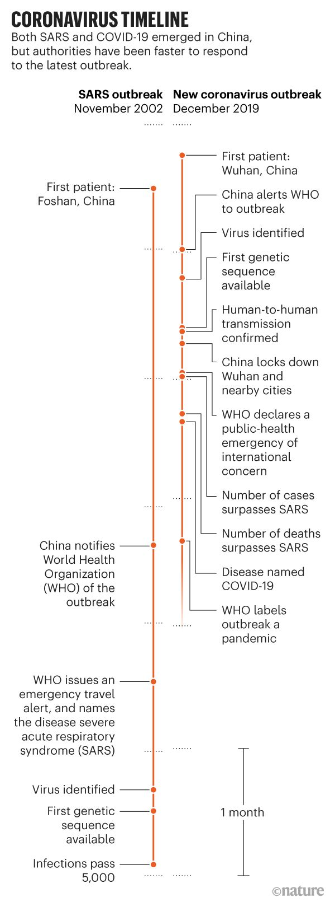

# Callaway-E-Cyranoski-C-Mallapaty-S-Stoye-E-Tollefson-J-2020.03-Coronavirus-Pandemic-Five-Charts-Nature

Ewen Callaway, David Cyranoski, Smriti Mallapaty, Emma Stoye, and Jeff Tollefson. 2020. [The coronavirus pandemic in five powerful charts](https://www.nature.com/articles/d41586-020-00758-2), Nature (18 Mar) DOI: 10.1038/d41586-020-00758-2 https://www.nature.com/articles/d41586-020-00758-2

## **How is the coronavirus spreading around the world?**

The coronavirus emerged in Wuhan, a city of 11 million people in China's Hubei province, in late 2019. Cases of the disease it causes, COVID-19, grew by several thousand per day in China in late January and early February, the peak of the epidemic there.

The number of infections appearing each day has since plummeted in China, owing in large part to containment efforts, but the outbreak is now a global pandemic. Large outbreaks in South Korea, Iran, Italy and elsewhere have propelled a spike in international cases across more than 150 countries.

Source: World Health Organization

------

The total number of confirmed cases outside China has now eclipsed those inside the country, and on 13 March, the World Health Organization's director-general Tedros Adhanom Ghebreyesus, said Europe had become the epicentre of the pandemic.

## **How does COVID-19 compare to other diseases?**

Current estimates of COVID-19’s case fatality rate — a measure of the proportion of infected people who eventually die — suggest that the coronavirus is less deadly than the pathogens behind other large-scale outbreaks, such as of SARS (severe acute respiratory syndrome), MERS (Middle East respiratory syndrome) and Ebola.

But the infection also seems to spread more easily than other diseases, including seasonal influenza. Calculations of the virus’s basic reproduction number, or $R_0$ — the number of people on average one infected person will pass the virus to — suggest a range of 2–2.5.

---

Like the case fatality rate, $R_0$ is an estimate that can vary considerably by location, with age group, and over time, and that is likely to be revised. It is calculated using models that take into account how long an infected person remains contagious, the likelihood of them infecting contacts and how often they come into contact with other people.

## **How fast are researchers publishing new coronavirus research?**

The outbreak has prompted an explosion of research on the coronavirus and the disease that it causes. To get an estimate of the scale of research activity, *Nature* searched for studies using the terms ‘novel coronavirus’, ‘ncov’, ‘COVID-19’ and ‘SARS-CoV-2’ on the bioRxiv, medRxiv, ChemRxiv and ChinaXiv servers, as well as compiling publications listed by the WHO, and on Google Scholar. As of 12 March there had been around 900 papers, preprints and preliminary reports related to coronavirus.

---

The research covers a range of subjects, including the structure of the virus; how it spreads in different communities; clinical features of the disease; potential drug targets; how effective quarantine measures are; and the psychological effects of the outbreak on health workers. At least 20 of the preprints that were shared early in the outbreak have since been published in peer-reviewed journals.

Researchers have also shared genomic data on the virus using online platforms such as GISAID and GenBank, and several clinical trials are under way for potential vaccines or treatments. *Nature*’s analysis does not include these reports or data. Neither does it include studies published in languages other than English, for example in Chinese-language journals. It is therefore likely to underestimate the total body of work on the coronavirus so far.

## **How have travel restrictions affected carbon emissions and air quality?**

China’s efforts to control the outbreak seem to have curbed energy consumption — and air pollution. Satellite data collected by NASA and the European Space Agency show a sharp reduction in atmospheric levels of nitrogen dioxide (NO2), which is produced during fossil fuel combustion, across the country.

---

Each year, industrial activity typically drops off as businesses and factories close for celebrations of the lunar New Year, which this year began on 25 January. This usually causes a brief dip in levels of NO2. “Normally, the pollution levels pick back up after 7–10 days, but that has not happened this year,” says Fei Liu, an atmospheric scientist at NASA’s Goddard Space Flight Center in Greenbelt, Maryland. A preliminary analysis suggests that NO2 pollution after the lunar New Year was around 10–30% lower this year than during the same period in previous years. A similar trend of declining NO2 pollution has also been documented in northern Italy — where cities remain on lockdown — using data from the European Space Agency's Sentinel-5P satellite.

Ongoing efforts to contain the coronavirus have suppressed China’s industrial activity by 15–40%, according to an analysis by the Centre for Research on Energy and Clean Air in Helsinki. Coal consumption hit a four-year low in February, and oil refining fell by more than one-third. Overall, the centre’s analysis suggests that China’s carbon emissions have dropped by more than 25% as a result of the ongoing efforts to contain the coronavirus.

## **How does the current pandemic compare to the 2003 SARS outbreak?**

The COVID-19 coronavirus has, from the beginning, drawn comparisons to the 2002–03 outbreak of SARS. Both originated in China before spreading around the world. Both were identified as new coronaviruses, deadlier than the handful of related viruses that cause common colds. The SARS coronavirus was found to have jumped to people from civet cats that had picked it up from bats. The COVID-19 virus, called SARS-CoV-2, is also thought to have come from bats, either directly or through an as-yet unidentified mammal. Both viruses caused chaos and economic disaster. But the two outbreaks have progressed very differently, especially in the speed and extent of spread.

---

The SARS outbreak went on for three months before being identified as a distinct disease. Then, for nearly two more months, it was a disease in search of a pathogen: the identification and genomic sequencing of the virus itself largely came from researchers outside China.

By contrast, three weeks after the first known case of the disease now known as COVID-19, China had notified the WHO of a spike in cases of a pneumonia-like disease. Two weeks after that, the coronavirus had been isolated, genetically sequenced, and a diagnostic test developed, giving China the tools it needed to launch one of the greatest infectious-disease containment efforts the world has ever seen.

The COVID-19 virus, although not as lethal as SARS, has proved much more pervasive. It took less than two months from the discovery of the first infection for the number of confirmed cases to pass the total that SARS reached over several months. And in three months, COVID-19 has killed more than five times as many people as SARS.