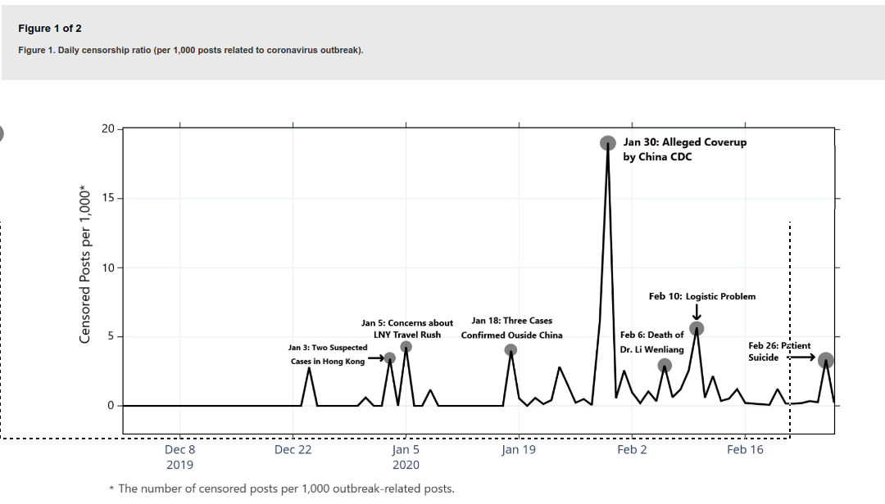
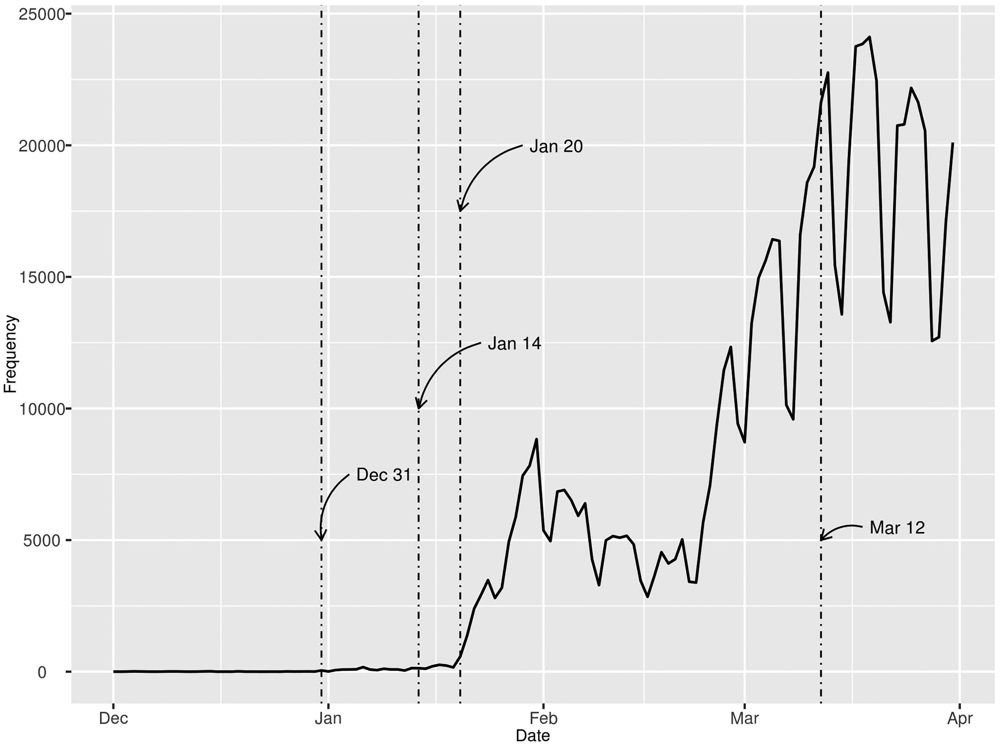

# Fu-KW-Zhu-Y-2020.04-World-Overlook-Early-Warning-COVID-19-JRR

Fu, King-wa and Zhu, Yuner. 2020. "Did the World Overlook the Media's Early Warning of COVID-19?", Journal of Risk Research (Apr) DOI: 10.1080/13669877.2020.1756380

Abstract: This perspective is written to give a rapid response to discuss the role of media in risk communication in the first three months of the COVID-19 pandemic. We analyze two sets of media data, China’s social media and global news event, and draw a few initial observations in relation to the impacts of China’s information control policy, global risk governance, and the role of WHO.

Keywords: Risk communication

(DQ response)

1. As Ben Rolfe pointed out, the 12 Mar 2020 WHO call of "pandemic" is largely irrelevant as it has little significance for international agreements. The key event is instead WHO's 30 Jan 2020 declaration of a Public Health Emergency of International Concern (PHEIC). This was, in turn, preceded by the 23 Jan 2020 Emergency Committee meeting&mdash;involving representation from the US, China, Canada, France, Thailand, and Singapore (among others)&mdash;where the Committee, after hearing China's presentation, and acknowledging both human-to-human transmission and a preliminary estimate of $R_0$ between 1.4 and 2.5, disagreed on whether PHEIC was appropriate. The advice the Committee gave WHO and its Director-General was, instead, to try to come up with a system that was less restrictive and binary.
2. (Fig 1) My own view is that in their Weiboscope project (covering 500mn active Weibo users in 2019) their discovering an error message of "permission denied" on a post need not indicate censoring. The user could themselves have deleted the message. But, be that as it may, they tracked posts made by 66,000 high-profile influencers and 52,000 randomly-selected accounts, containing outbreak-related keywords to estimate a censorship rate of 1.7 per 1000 [2,100 out of 1.2mn; total posts not necessarily outbreak-related numbered 11.4mn].
3. (Fig 2) GDELT analysis - more interesting. But the way I read this is that the world's press overlooked the news coming out of WHO, not a China cover-up.

Fig 1: Authors' interpretation, censored Weibo posts

Fig 2: GDELT. World Press Events for coronavirus, pneumonia, SARS

